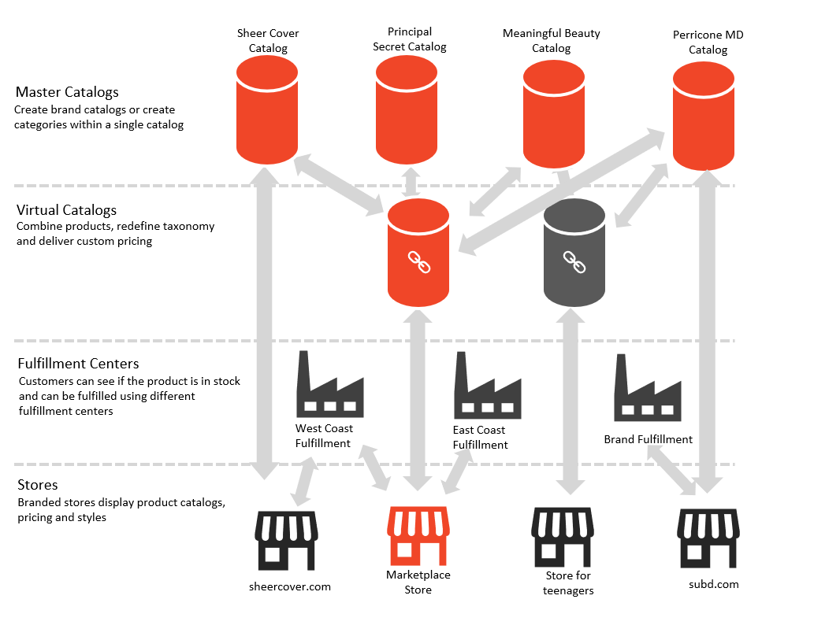

# Virto Commerce Catalog Module

The Catalog module presents the ability to add items to your e-commerce store.  It can be electronics, groceries, digital content or anything else. Items can be grouped into categories and catalogs. The item grouping is individual depending on the stock size, item types, vendors, etc.

The Catalog Module supports two types of catalogs - master and virtual.

## Key features
* Master and Virtual catalogs
* Multiple languages
* Multiple currencies
* Physical and Digital products
* Subscription products
* SEO Information
* Product Variations
* Product & Category attributes
* Flexible properties inheritance
* Sort and filter product listing based on any attribute
* Associations 
* Personalization
* Categories taxonomy
* Full-text search engine
* Enterprise ready - supports millions of the products

## Documentation
* [Catalog Module Documentation](https://virtocommerce.com/docs/latest/modules/catalog/index/)
* [View on GitHub](docs/index.md)

## References

* Deploy: https://virtocommerce.com/docs/latest/developer-guide/deploy-module-from-source-code/
* Installation: https://www.virtocommerce.com/docs/latest/user-guide/modules/
* Home: https://virtocommerce.com
* Community: https://www.virtocommerce.org
* [Download Latest Release](releases/latest)

## License

Copyright (c) Virto Solutions LTD.  All rights reserved.

Licensed under the Virto Commerce Open Software License (the "License"); you
may not use this file except in compliance with the License. You may
obtain a copy of the License at

http://virtocommerce.com/opensourcelicense

Unless required by applicable law or agreed to in writing, software
distributed under the License is distributed on an "AS IS" BASIS,
WITHOUT WARRANTIES OR CONDITIONS OF ANY KIND, either express or
implied.
