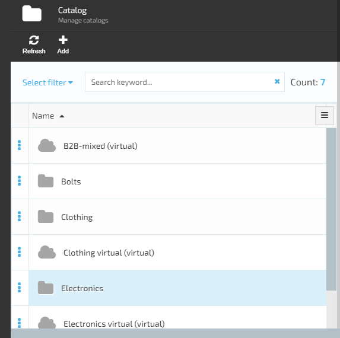
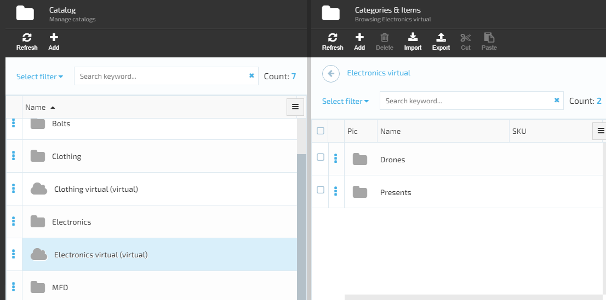
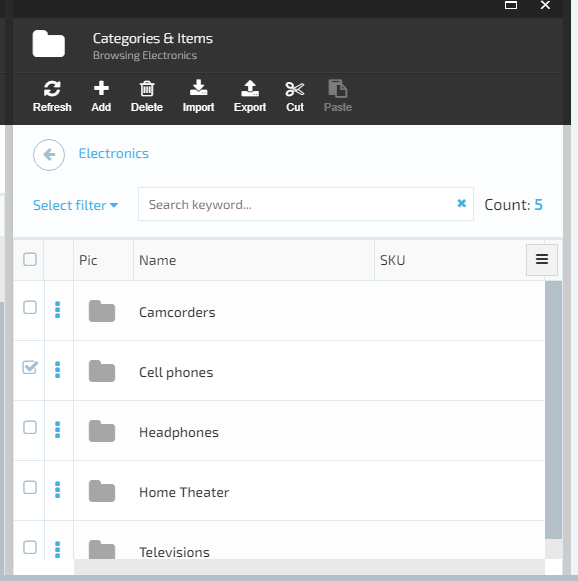
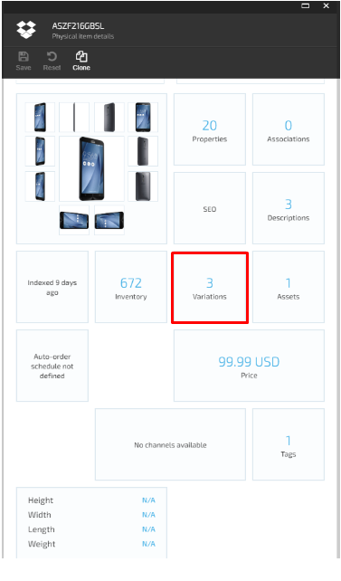
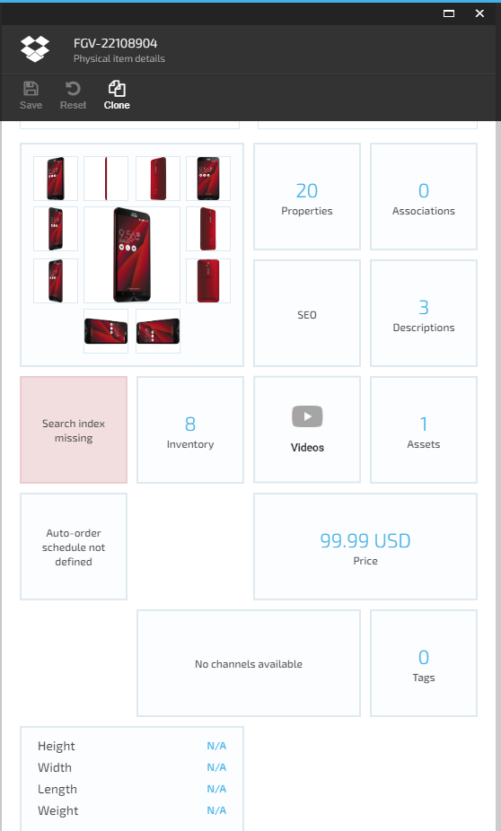
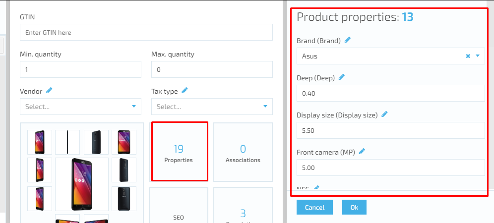

# VirtoCommerce Catalog Module

## Overview

The Catalog module presents the ability to add items to your e-commerce store.  It can be electronics, groceries, digital content or anything else. Items can be grouped into categories and catalogs. The item grouping is individual depending on the stock size, item types, vendors, etc.

### Common Catalogs

A (common) catalog is defined as a list of items or services that a company showcases online. Physically the catalog is a collection of items, which can be grouped into categories. An item can be assigned to only one category or be direct child of a catalog without any category.  
 Each trademark or product line should have its own catalog of all the offerings in that category. Or when dealing with several suppliers. In this case each supplier should have its own catalog with offered items.

### Manage Catalogs

[View catalogs and physical items details](/docs/view-catalogs-and-physical-items.md)

[Add new catalog](/docs/add-new-catalog.md)
[Catalog](/docs/catalog.md)

### Virtual Catalogs

Virtual catalogs are created from one or more common catalogs. This kind of catalogs aggregates multiple base catalogs into a single catalog. Virtual catalogs are generally used to display seasonal goods that can be collected from multiple catalogs.
A virtual catalog must have a unique name different from other virtual catalogs and common catalogs. Though virtual catalogs are composed of items and categories from common catalogs, items from a virtual catalog cannot be added to another virtual catalog.
The major difference between a catalog and a virtual catalog is that the second one is just a view of items from common catalogs. Physically all items from a virtual catalog are located in common catalogs. This also means that if a modification is made to an item in the common catalog, the update will be reflected in all virtual catalogs instantly.

[Add virtual catalog](/docs/add-virtual-catalog.md)

### Categories

A category is a container for other categories or items. Category in the catalog can have sub-categories. Categories allow building hierarchy and relationship between various items in the catalog. This helps to make it easier for customers to navigate to the items they would like to purchase. Large catalogs containing many items should be organized using parent-child relations.

### Items (Product)

A product with its variations in the system is presented as a collection of products (variations).

The title (main) product has variative property set of values. And all other products (variations) has the relation with the title product. Every product that has relation to the title product (variation) can inherit some property values of the title product (description, assets etc.) but can also override the values of those properties if they differ from the title product (variation) property values.

To show such a product with variations on the storefront, the title product (main) is loaded with all the related products (variations). Property values of the title product are used for product description. SKU selector for such a product with variations is built using variations properties of the title product and its variations.
So, an item concept in Virto Commerce is a generalization of Variation/SKU or Product. An item corresponds to item in the store that can be promoted and sold.

User can manage simple item properties as well as complex information:

1. Custom properties.
1. SEO information.
1. Associations (associated items).
1. Assets.
1. Images.
1. Variations (SKUs).
1. Inventory.
1. Prices.

Inventory and prices management are integrated from other modules - “Virto Commerce Inventory” and “Virto Commerce Pricing” respectively.

### Variations

In case there is a need to add variations of the product, a relation should be implemented between the products as well as special type of variative properties definition added. Thus, a product with its variations in the system is presented as a collection of products (variations) The title (main) product can be also a variation. The title product has variative property values set. And all other products (variations) has the relation with the title product. Every product that has relation to the title product (variation) can inherit some property values of the title product (description, assets etc.) but can also override the values of those properties if they differ from the title product (variation) property values. 
To show such a product with variations on the storefront, the title product (variation) is loaded with all the related products (variations). Property values of the title product (variation) are used for the main product description. SKU selector for such a product with variations is built using variations properties of the title product and its variations.

### Properties

Properties (or custom properties) is the additional characteristics for your catalog entities. They can be defined at different levels of item hierarchy:

1. Catalog - value assigned in catalog level.
1. Category - value assigned in category level and can be overwritten in child categories.
1. Product - value assigned in item or variation level.

All properties defined in parent hierarchy entities are available in (inherited by) item. E.g. every item inside catalog will have property “Brand” with value “Sony” once it was defined in parent catalog and was assigned such value there.

Every property has its “Assign to” trait set to one of: “catalog”, “category”, “product” or “variation”. This defines at what level the property’s value can be set.

### Linked Category

Common category has the same meaning as the category in common catalogs. User can create common category and link products to it or create linked category in it.

catalog CRUD:

- properties.

category CRUD:

- properties;
- SEO.

virtual catalog CRUD:

- categories;
- including categories from other (real) catalogs.

Expandability points:

- additional widgets in (virtual) catalog detail;
- additional widgets in category detail;
- additional widgets in item detail.

## Manage Catalogs

