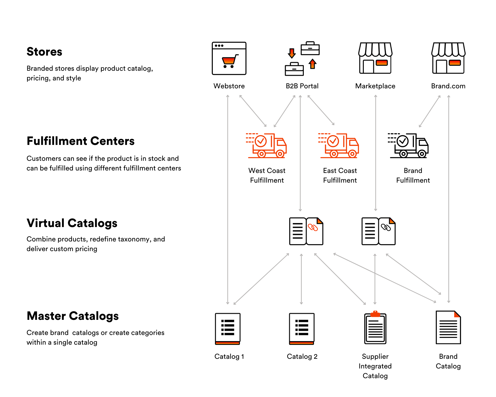

# Virto Commerce Catalog Module

    

The Catalog module presents the ability to add items to your e-commerce store.  It can be electronics, groceries, digital content or anything else. Items can be grouped into categories and catalogs. The item grouping is individual depending on the stock size, item types, vendors, etc.

The Catalog Module supports two types of catalogs - master and virtual.

## Key features
* Master and Virtual catalogs
* Multiple languages
* Multiple currencies
* Physical and Digital products
* Subscription products
* SEO Information
* Product Variations
* Product & Category attributes
* Flexible properties inheritance
* Sort and filter product listing based on any attribute
* Associations 
* Personalization
* Categories taxonomy
* Full-text search engine
* Enterprise ready - supports millions of the products

## Configuration

The module's behavior can be tuned through Platform Settings (**Settings > Catalog**). All settings are optional; the values listed below are the defaults applied when a setting is left unchanged.

### General

| Setting | Type | Default | Description |
|---------|------|---------|-------------|
| `Catalog.ImageCategories` | String (dictionary) | — | Dictionary of possible image category options for catalog items. |
| `Catalog.AssociationGroups` | String (dictionary) | — | Product association group names. |
| `Catalog.EditorialReviewTypes` | String (dictionary) | `QuickReview` | Dictionary of possible description types for an item. |
| `Catalog.CategoryDescriptionTypes` | String (dictionary) | `QuickReview` | Dictionary of possible description types for a category. |
| `Catalog.UseSeoDeduplication` | Boolean | `false` | Enable/disable detection of SEO duplicates. |
| `Catalog.Search.EventBasedIndexation.Enable` | Boolean | `true` | Enable/disable automatic background indexing of catalog entities whenever they are changed. |
| `Catalog.ProductConfigurationMaximumFiles` | Positive integer | `5` | Maximum number of files allowed in a product configuration section. |
| `Catalog.BrandStoreSetting.BrandsEnabled` | Boolean | `false` | Enable/disable the Brands page on the storefront. Store-level, public. |
| `Catalog.BrandStoreSetting.BrandCatalogId` | String | — | Catalog ID used for brands. Store-level. |
| `Catalog.BrandStoreSetting.BrandPropertyName` | String | — | Property name used for the brand. Store-level. |

### Search

| Setting | Type | Default | Description |
|---------|------|---------|-------------|
| `Catalog.Search.UseCatalogIndexedSearchInManager` | Boolean | `true` | Enable/disable indexed search (with advanced syntax) for the Catalog module in the back office. |
| `Catalog.Search.UseFullObjectIndexStoring` | Boolean | `false` | Enable/disable storing serialized catalog objects in the index and returning them in search results. |
| `Catalog.Search.IndexLinkPriorityFields` | Boolean | `true` | Enable/disable indexing of fields used to calculate the priority of linked objects in search results. |
| `Catalog.Search.DefaultAggregationSize` | Integer | `25` | Size for aggregations when not defined in the store's aggregation properties. Set to `0` for unlimited size. |
| `VirtoCommerce.Search.IndexingJobs.IndexationDate.Product` | Date/time | — | Date and time the product indexing task starts. |
| `VirtoCommerce.Search.IndexingJobs.IndexationDate.Category` | Date/time | — | Date and time the category indexing task starts. |
| `Catalog.BrowseFilters.FilteredBrowsing` | JSON | — | Per-store faceted browsing filter configuration. Edited through the *Filtering properties* widget on the store page. Store-level. |
| `Catalog.BrowseFilters.FilteredBrowsingMigrated` | Boolean | `false` | Internal flag marking that legacy filtered-browsing configuration has been migrated. Hidden; not intended for manual editing. |

### Backup & Restore

These settings tune the module's backup/restore (export/import) pipeline. The defaults preserve the previous hard-coded behavior.

| Setting | Type | Default | Description |
|---------|------|---------|-------------|
| `Catalog.BackupRestore.BatchSize` | Positive integer | `50` | Number of records saved per batch during catalog export and import. Lower values reduce memory usage; higher values improve throughput. |
| `Catalog.BackupRestore.ErrorPolicy` | String (`Stop`, `SkipBatch`, `SkipItem`) | `SkipItem` | Behavior when a batch fails to save during import: `Stop` aborts the module import, `SkipBatch` skips the whole failed batch, `SkipItem` retries items one-by-one and skips only the failing rows. |

## Documentation
* [Catalog module user documentation](https://docs.virtocommerce.org/platform/user-guide/catalog/overview/)
* [GraphQL API documentation](https://docs.virtocommerce.org/platform/developer-guide/GraphQL-Storefront-API-Reference-xAPI/Catalog/overview/)
* [View on GitHub](https://github.com/VirtoCommerce/vc-module-catalog)

## References

* [Deployment](https://docs.virtocommerce.org/platform/developer-guide/Tutorials-and-How-tos/Tutorials/deploy-module-from-source-code/)
* [Installation](https://docs.virtocommerce.org/platform/user-guide/modules-installation/)
* [Home](https://virtocommerce.com)
* [Community](https://www.virtocommerce.org)
* [Download latest release](https://github.com/VirtoCommerce/vc-module-catalog/releases/latest)

## License

Copyright (c) Virto Solutions LTD.  All rights reserved.

Licensed under the Virto Commerce Open Software License (the "License"); you
may not use this file except in compliance with the License. You may
obtain a copy of the License at

http://virtocommerce.com/opensourcelicense

Unless required by applicable law or agreed to in writing, software
distributed under the License is distributed on an "AS IS" BASIS,
WITHOUT WARRANTIES OR CONDITIONS OF ANY KIND, either express or
implied.
