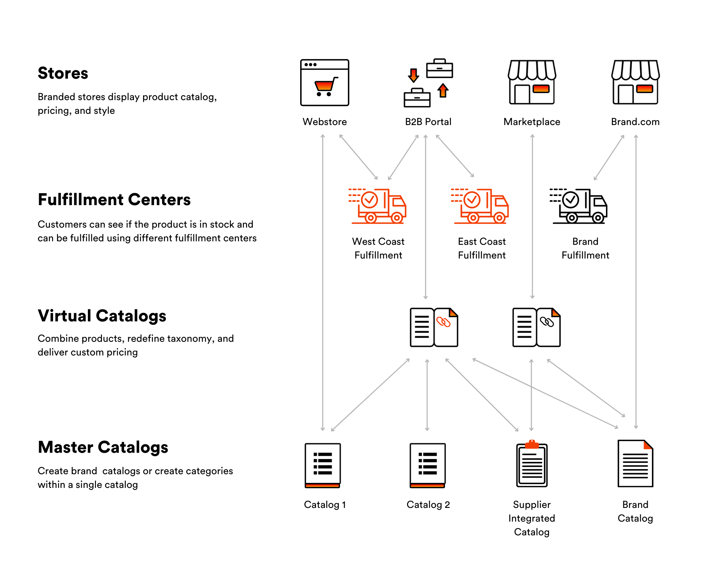

# Virto Commerce Catalog Module

[](https://github.com/VirtoCommerce/vc-module-catalog/actions?query=workflow%3A"Module+CI") [](https://sonarcloud.io/dashboard?id=VirtoCommerce_vc-module-catalog) [](https://sonarcloud.io/dashboard?id=VirtoCommerce_vc-module-catalog) [](https://sonarcloud.io/dashboard?id=VirtoCommerce_vc-module-catalog) [](https://sonarcloud.io/dashboard?id=VirtoCommerce_vc-module-catalog)

The Catalog module presents the ability to add items to your e-commerce store.  It can be electronics, groceries, digital content or anything else. Items can be grouped into categories and catalogs. The item grouping is individual depending on the stock size, item types, vendors, etc.

The Catalog Module supports two types of catalogs - master and virtual.



## Key features
* Master and Virtual catalogs
* Multiple languages
* Multiple currencies
* Physical and Digital products
* Subscription products
* SEO Information
* Product Variations
* Product & Category attributes
* Flexible properties inheritance
* Sort and filter product listing based on any attribute
* Associations 
* Personalization
* Categories taxonomy
* Full-text search engine
* Enterprise ready - supports millions of the products

## Configuration

The module's behavior can be tuned through Platform Settings (**Settings > Catalog**). All settings are optional; the values listed below are the defaults applied when a setting is left unchanged.

### General

| Setting | Type | Default | Description |
|---------|------|---------|-------------|
| `Catalog.ImageCategories` | String (dictionary) | — | Dictionary of possible image category options for catalog items. |
| `Catalog.AssociationGroups` | String (dictionary) | — | Product association group names. |
| `Catalog.EditorialReviewTypes` | String (dictionary) | `QuickReview` | Dictionary of possible description types for an item. |
| `Catalog.CategoryDescriptionTypes` | String (dictionary) | `QuickReview` | Dictionary of possible description types for a category. |
| `Catalog.UseSeoDeduplication` | Boolean | `false` | Enable/disable detection of SEO duplicates. |
| `Catalog.Search.EventBasedIndexation.Enable` | Boolean | `true` | Enable/disable automatic background indexing of catalog entities whenever they are changed. |
| `Catalog.ProductConfigurationMaximumFiles` | Positive integer | `5` | Maximum number of files allowed in a product configuration section. |
| `Catalog.BrandStoreSetting.BrandsEnabled` | Boolean | `false` | Enable/disable the Brands page on the storefront. Store-level, public. |
| `Catalog.BrandStoreSetting.BrandCatalogId` | String | — | Catalog ID used for brands. Store-level. |
| `Catalog.BrandStoreSetting.BrandPropertyName` | String | — | Property name used for the brand. Store-level. |

### Search

| Setting | Type | Default | Description |
|---------|------|---------|-------------|
| `Catalog.Search.UseCatalogIndexedSearchInManager` | Boolean | `true` | Enable/disable indexed search (with advanced syntax) for the Catalog module in the back office. |
| `Catalog.Search.UseFullObjectIndexStoring` | Boolean | `false` | Enable/disable storing serialized catalog objects in the index and returning them in search results. |
| `Catalog.Search.IndexLinkPriorityFields` | Boolean | `true` | Enable/disable indexing of fields used to calculate the priority of linked objects in search results. |
| `Catalog.Search.DefaultAggregationSize` | Integer | `25` | Size for aggregations when not defined in the store's aggregation properties. Set to `0` for unlimited size. |
| `VirtoCommerce.Search.IndexingJobs.IndexationDate.Product` | Date/time | — | Date and time the product indexing task starts. |
| `VirtoCommerce.Search.IndexingJobs.IndexationDate.Category` | Date/time | — | Date and time the category indexing task starts. |
| `Catalog.BrowseFilters.FilteredBrowsing` | JSON | — | Per-store faceted browsing filter configuration. Edited through the *Filtering properties* widget on the store page. Store-level. |
| `Catalog.BrowseFilters.FilteredBrowsingMigrated` | Boolean | `false` | Internal flag marking that legacy filtered-browsing configuration has been migrated. Hidden; not intended for manual editing. |
| `Catalog.Search.BarcodeScannerEnabled` | Boolean | `true` | Show the barcode scanner button in the storefront search bar. Store-level, public. See [Barcode scanner search](#barcode-scanner-search). |
| `Catalog.Search.BarcodeSearchFields` | JSON | — | Product index fields a scanned code is matched against; empty/`null` means full-text search. Edited through the *Search configuration → Barcode scanner* widget on the store page. Store-level, public. See [Barcode scanner search](#barcode-scanner-search). |
| `Catalog.Search.ProductSortings` | JSON | — | Per-store product sorting ("sort by") options — admin overrides of the built-in orderings plus any custom orderings. `null` means "use the code defaults". Edited through the *Search configuration → Sorting* widget on the store page. Store-level. See [Configurable product sorting](#configurable-product-sorting). |

### Backup & Restore

These settings tune the module's backup/restore (export/import) pipeline. The defaults preserve the previous hard-coded behavior.

| Setting | Type | Default | Description |
|---------|------|---------|-------------|
| `Catalog.BackupRestore.BatchSize` | Positive integer | `50` | Number of records saved per batch during catalog export and import. Lower values reduce memory usage; higher values improve throughput. |
| `Catalog.BackupRestore.ErrorPolicy` | String (`Stop`, `SkipBatch`, `SkipItem`) | `SkipItem` | Behavior when a batch fails to save during import: `Stop` aborts the module import, `SkipBatch` skips the whole failed batch, `SkipItem` retries items one-by-one and skips only the failing rows. |

## Configurable product sorting

Product sort options ("sort by") for category browsing and search are **store-configurable and code-extensible** rather than hard-coded. Category managers control which orderings shoppers see, their labels (localizable), their order, and which one is the default.

### How it works

- **Code-first resolvers are the source of truth for which orderings exist.** Each ordering is an `IProductSortingResolver` registered in DI. The seven built-ins (Featured, A–Z, Z–A, Price low→high / high→low, Date new→old / old→new) ship as code, so they exist in every environment with no seeding and no migration. `Featured` resolves to `__score:desc;priority:desc;id:asc`.
- **The store-level setting holds only overrides, not the source of truth.** `Catalog.Search.ProductSortings` (JSON, store-level) stores admin **deltas** keyed by `code` (renamed label / changed order / hidden / edited clauses) plus any admin-authored **custom** orderings. `null`/empty means "use the code defaults", so changes to a resolver's code defaults flow through to untouched fields.
- **Composition.** `IProductSortingService` merges the resolvers with the stored deltas into the effective list. Two orthogonal per-resolver gate flags govern overriding: `AllowOverride` (admin may change name/order/visibility) and `IsExpressionEditable` (admin may edit the sort clauses), both default `true`. Setting either to `false` in code is a no-migration "kill switch" that forces the code value.
- **Default ordering** is the first visible ordering (there is no stored `IsDefault`); an empty incoming `sort` resolves to it.

### Configuring in the admin UI

Open **Store → Search configuration → Sorting**. Drag to reorder (the first visible row is the default), toggle visibility, rename (with per-language localization), edit the sort clauses, and add/remove custom orderings. The system `code` is the stable key used by the API and the storefront `?sort=` URL, so it can be set only when an ordering is created.

> **Note on persisted order.** Reordering and saving stores explicit `order` values for the orderings. For a resolver whose code `Info.Order` does not equal its position in the default-sorted list, the saved value (a contiguous list index) won't match the code default, so an order-only delta remains in `Catalog.Search.ProductSortings` even after the list is dragged back to the default arrangement — the setting does not return to empty once a reorder has been saved. This is expected behavior, not a defect: the saved list is the admin's persisted intent, the stored values still produce the same displayed order (in both the admin and the storefront), and an admin override always wins over the code `Info.Order` until the ordering is changed again.

### Extending from code

Contribute a new ordering by registering a resolver — no admin action, no DB seeding, no migration:

```csharp
public class VendorAscendingProductSortingResolver : AbstractExpressionProductSortingResolver
{
    public override string Code => "vendor-ascending";
    public override ProductSortingInfo Info { get; } = new() { Name = "Vendor (A-Z)", Order = 35 };
    protected override string DefaultExpression => "vendor:asc"; // logical expression; bound to the physical index field downstream
}

// in Module.Initialize:
serviceCollection.AddSingleton<IProductSortingResolver, VendorAscendingProductSortingResolver>();
```

For an ordering whose expression depends on the request (e.g. a different order per category), implement `IProductSortingResolver` directly and compute the expression in `GetSortExpression(ProductSortingContext context)` (the context carries store, catalog, current category/outline, currency, culture, keyword, filter and facet).

### API

- **REST (admin):** `GET`/`PUT api/catalog/product-sortings/store/{storeId}` (plus `GET .../fields` for the clause-field picker, derived from the product index schema). Guarded by the `catalog:BrowseFilters:Read` / `catalog:BrowseFilters:Update` permissions.
- **GraphQL (storefront):** the `products` connection exposes `sortings { id name isDefault selected }`. An empty `sort` applies the store default, a known `code` applies that ordering, and an unknown token / raw expression passes through to the search engine unchanged.

## Barcode scanner search

The storefront search bar can scan a barcode with the device camera. Each store decides whether the scanner button is
shown at all and how a scanned code is matched: by **full-text search** (the default, the scanned value is searched in
the whole product text) or by an **exact match** on selected product index fields.

### Configuring in the admin UI

Open **Store → Search configuration → Barcode scanner**:

- **Enable barcode scanner in the storefront** — hides/shows the scanner button (`Catalog.Search.BarcodeScannerEnabled`).
- **Match scanned code by** — *Full-text search* or *Exact match on selected fields*.
- The field picker offers only fields that exist in the **product search index**: the built-in `code` (SKU), `gtin` and
  `manufacturerPartNumber` (MPN) plus every **short text** catalog property of type *Product* or *Variation*. Free text
  is not accepted and the server re-validates the selection on save. A previously saved field that is no longer in the
  index is shown with a *missing from index* badge and is removed from the selection as soon as any field or the
  match mode is changed, so it is never saved again.

`Catalog.Search.BarcodeSearchFields` is meant to be edited through this widget, which is the only place that validates
the selection against the live product index schema. Values written directly through the generic settings API are not
validated: an unknown field name is stored as-is and simply matches nothing (the widget then shows it as *missing from
index* and drops it from the selection at the first change).

### Filling barcode data

- **GTIN** — the packaging barcode: UPC, EAN, ISBN or JAN.
- **MPN** — the manufacturer part number.
- **SKU** — the product code.
- Any other code, or several codes of the same kind: create a **short text** catalog property for products or variations
  (long text is not indexed as a filterable field) and select it in the blade. Mark the property **multi-value** to store
  several codes in one property — the term filter matches any of its values.
- Several *kinds* of code (e.g. GTIN and a custom property) can be selected at once; they are matched with OR.
- Products must be **re-indexed** after the values or the property definitions change. Matching is exact: the
  scanned value must equal the stored value.

### How the storefront searches

The storefront sends the scanned value as the `barcode:"<value>"` filter of the `products` GraphQL query. The XCatalog
module expands that virtual filter into a term filter over the configured fields (OR across them, variations included);
with no configured field the scanned value stays an ordinary full-text keyword.

That expansion lives in the **XCatalog** module, not here: this module owns the settings, the REST API and the admin UI
only. Because of that cross-repo dependency the changes must be merged in the order catalog -> x-catalog -> storefront
theme.

### API

- **REST (admin):** `GET`/`PUT api/catalog/barcode-search/store/{storeId}` (plus `GET .../store/{storeId}/fields` for the
  field picker, derived from the product index schema). Guarded by the `catalog:BrowseFilters:Read` /
  `catalog:BrowseFilters:Update` permissions; saving an unknown field returns `400`.
- **Storefront:** both settings are public, so they are exposed as store module settings and drive the scanner button
  and the matching mode.

## Documentation
* [Catalog module user documentation](https://docs.virtocommerce.org/platform/user-guide/catalog/overview/)
* [GraphQL API documentation](https://docs.virtocommerce.org/platform/developer-guide/GraphQL-Storefront-API-Reference-xAPI/Catalog/overview/)
* [View on GitHub](https://github.com/VirtoCommerce/vc-module-catalog)


## References

* [Deployment](https://docs.virtocommerce.org/platform/developer-guide/Tutorials-and-How-tos/Tutorials/deploy-module-from-source-code/)
* [Installation](https://docs.virtocommerce.org/platform/user-guide/modules-installation/)
* [Home](https://virtocommerce.com)
* [Community](https://www.virtocommerce.org)
* [Download latest release](https://github.com/VirtoCommerce/vc-module-catalog/releases/latest)

## License

Copyright (c) Virto Solutions LTD.  All rights reserved.

Licensed under the Virto Commerce Open Software License (the "License"); you
may not use this file except in compliance with the License. You may
obtain a copy of the License at

http://virtocommerce.com/opensourcelicense

Unless required by applicable law or agreed to in writing, software
distributed under the License is distributed on an "AS IS" BASIS,
WITHOUT WARRANTIES OR CONDITIONS OF ANY KIND, either express or
implied.
