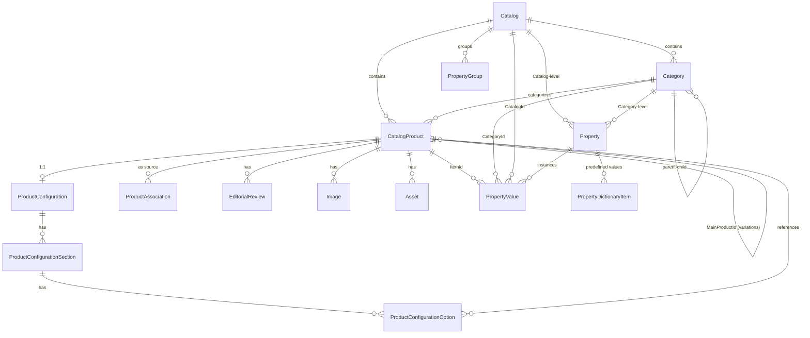
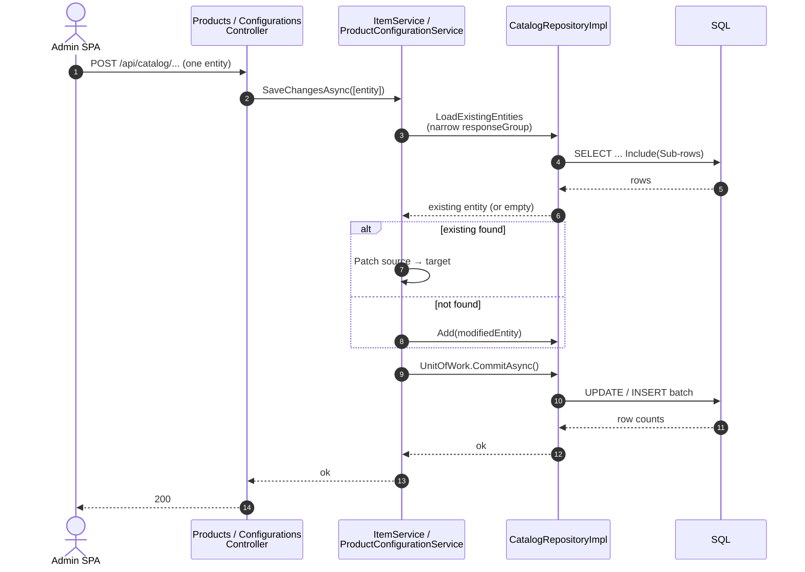

# Catalog Domain Model — developer reference

This document is the authoritative map of how the Virto Commerce catalog module models its data, what loads with what, and what saves with what. It was written after a long debugging session through the 3.x backup/restore code where assumptions about "the parent product save also handles its variations / configurations / associations" turned out to be wrong and produced EF tracker races. The takeaway from that session is encoded as **save-graph rules** below — read those first if you are about to extend the model.

## At a glance — entity relationships



The diagram shows ownership and referential edges only. **It does not show save-graph boundaries** — some of these edges are owned (sub-rows ride inside the parent's `SaveChangesAsync`), others are not (the sub-row has its own service). See [§3](#3-save-graph-rules) for that map.

## 1. Top-level entities

All Core entities live in `src/VirtoCommerce.CatalogModule.Core/Model/`. Below, "owns" means the parent's persistence is responsible for the child collection's lifetime; "references" means the child has its own persistence and the parent only points at it.

| Entity | Parent | Owns (sub-collections in same save graph) | References / managed separately |
|---|---|---|---|
| **`Catalog`** | — (root) | `Languages` | `Properties`, `PropertyGroups`, `SeoInfos` |
| **`Category`** | `Catalog`, optional parent `Category` | `Images`, `Assets`, `Links`, `SeoInfos`, `Descriptions`, `PropertyValues` | `Properties` (own table), `Children` (other Category rows) |
| **`CatalogProduct`** | `Catalog`, `Category` | `Images`, `Assets`, `PropertyValues`, `EditorialReviews`, `SeoInfos`, `Links` | `Variations` (other CatalogProduct rows w/ `MainProductId`), `Associations`, `ProductConfigurations` |
| **`Variation`** | A `CatalogProduct` (the *main product*) | Same as `CatalogProduct` — it **is** a `CatalogProduct` subclass | Saved as a standalone `CatalogProduct` with `MainProductId` set; never as a child of its main product's save graph |
| **`Property`** | `Catalog` or `Category` | `Attributes`, `DisplayNames`, `ValidationRules` | `DictionaryItems` (own service) |
| **`PropertyValue`** | `CatalogProduct`, `Category`, or `Catalog` (only one owner at a time) | none | The owner row is found via the value's `ItemId` / `CategoryId` / `CatalogId` FK |
| **`PropertyDictionaryItem`** | `Property` | `LocalizedValues` | — |
| **`PropertyGroup`** | `Catalog` | `LocalizedName`, `LocalizedDescription` | — |
| **`ProductAssociation`** | `CatalogProduct` (the source) | none | The associated object (product/category) is referenced, not owned |
| **`ProductConfiguration`** | `CatalogProduct` (1:1 typical) | `Sections` → `Options` | — |
| **`Measure`** | — (root) | `Units` | — |
| **`EditorialReview`** | `CatalogProduct` | none | — |
| **`CategoryLink`** | `CatalogProduct` or `Category` | none | Target `Catalog`/`Category` is referenced |
| **`Asset` / `Image`** | `CatalogProduct` or `Category` | none | — |
| **`SeoInfo`** | Any `ISeoSupport` host | none | Defined in `VirtoCommerce.Seo.Core.Models`; persisted via the host entity |

### Inheritance and "Variation as Product"

A variation **is a product**: `Variation : CatalogProduct` ([Variation.cs](../src/VirtoCommerce.CatalogModule.Core/Model/Variation.cs)). It has its own row in the `Item` table, its own Images, Assets, PropertyValues, etc. The only thing distinguishing a variation row from a top-level product row is the non-null `MainProductId` FK. The `CatalogProduct.Variations` collection on a parent product is a **read-side convenience** populated on demand by `ItemService` when the response group includes `Variations` — it is not a write-side composition.

Properties have an inheritance model (`IInheritable`): values inherited from the parent Category or Catalog flow down to the Product, and from Main Product to Variation. Inheritance is computed on read (`ItemService.ApplyInheritanceRules`, [ItemService.cs:404](../src/VirtoCommerce.CatalogModule.Data/Services/ItemService.cs#L404)) and is invisible at the persistence layer.

## 2. Response groups

Response groups are bit-flag enums that the read services use to decide which related rows to include in a query. They are also the input to `LoadEntities` (used by `Get*`) and **were historically** the input to `LoadExistingEntities` (used by `SaveChangesAsync`'s upsert existence-check). The two paths have now been split — see [§3](#3-save-graph-rules).

### `ItemResponseGroup` ([ItemResponseGroup.cs](../src/VirtoCommerce.CatalogModule.Core/Model/ItemResponseGroup.cs))

| Flag | Adds to read |
|---|---|
| `ItemInfo` (1) | Scalar fields only |
| `ItemAssets` (2) | `Assets` |
| `ItemProperties` (4) | `Properties` (definitions + values) |
| `ItemAssociations` (8) | `Associations` |
| `ItemEditorialReviews` (16) | `EditorialReviews` |
| `Variations` (32, **obsolete**) | `Variations` collection populated. Marked obsolete because of the perf footgun — large variation graphs blow up read cost. Prefer searching `ProductSearchService` by `MainProductId`. |
| `Seo` (64) | `SeoInfos` |
| `Links` (128) | `CategoryLinks` |
| `Inventory` (256) | Inventory data (cross-module) |
| `Outlines` (512) | Hierarchy paths |
| `ReferencedAssociations` (1024) | Reverse `Associations` (other products that point here) |

Presets: `ItemSmall`, `ItemMedium`, `ItemLarge`, `Full`.

### `CategoryResponseGroup` ([CategoryResponseGroup.cs](../src/VirtoCommerce.CatalogModule.Core/Model/CategoryResponseGroup.cs))

`Info`, `WithImages`, `WithProperties`, `WithLinks`, `WithSeo`, `WithParents`, `WithOutlines`, `WithDescriptions`, `WithAssets`. Preset: `Full`.

### `CatalogResponseGroup` ([CatalogResponseGroup.cs](../src/VirtoCommerce.CatalogModule.Core/Model/CatalogResponseGroup.cs))

`Info`, `WithProperties`, `WithSeo`. Preset: `Full`.

### `ProductConfigurationResponseGroup` ([ProductConfigurationResponseGroup.cs](../src/VirtoCommerce.CatalogModule.Core/Model/Configuration/ProductConfigurationResponseGroup.cs))

| Flag | Adds to read |
|---|---|
| `WithSections` | `Sections` collection (eagerly via `Include`) |
| `WithOptions` | Each section's `Options` collection (via `ThenInclude`). Implies `WithSections`. |
| `WithProducts` | Loads the Items (CatalogProducts) referenced by each option's `ProductId` into the same repository tracker, so the read-side `ResolveImageUrls` can populate `option.Product.Images`. |

Preset: `Full = WithSections | WithOptions | WithProducts`.

The **save path** uses `WithSections | WithOptions` only — explicitly *not* `WithProducts`. Loading option-referenced Items brings the `Item ↔ ProductConfiguration` 1:1 cascade-delete relationship under EF fixup, which is unnecessary for save and was contributing to tracker-state races.

## 3. Save-graph rules

This is the section to read before extending the model. The persistence layer's behaviour falls into three buckets, and which bucket an entity is in determines what code you write to save it correctly.

```mermaid
flowchart TB
    classDef bucketA fill:#e8f5e9,stroke:#388e3c,color:#1b5e20
    classDef bucketB fill:#fff3e0,stroke:#f57c00,color:#e65100
    classDef bucketC fill:#e3f2fd,stroke:#1976d2,color:#0d47a1

    subgraph A["Bucket A — owned by parent's save graph"]
        direction TB
        A1["Catalog.Languages"]
        A2["Category.Images / Assets / Links<br/>SeoInfos / Descriptions / PropertyValues"]
        A3["CatalogProduct.Images / Assets<br/>PropertyValues / EditorialReviews<br/>SeoInfos / Links"]
        A4["ProductConfiguration.Sections<br/>Section.Options (under same config)"]
        A5["Property.Attributes / DisplayNames<br/>ValidationRules"]
    end

    subgraph B["Bucket B — referenced, must save separately"]
        direction TB
        B1["Variations<br/>(CatalogProduct rows w/ MainProductId)"]
        B2["ProductAssociation<br/>(FK to other products)"]
        B3["ProductConfiguration<br/>(separate service)"]
        B4["Property / PropertyGroup<br/>(2-pass FK restore)"]
        B5["PropertyDictionaryItem<br/>(own service)"]
    end

    subgraph C["Bucket C — independent roots"]
        direction TB
        C1["Catalog"]
        C2["Measure"]
        C3["Top-level CatalogProduct"]
    end

    class A1,A2,A3,A4,A5 bucketA
    class B1,B2,B3,B4,B5 bucketB
    class C1,C2,C3 bucketC
```



### Bucket A — owned by the parent's save graph

When you call `parent.SaveChangesAsync(...)`, EF traverses the parent's collection (e.g. `Images`, `Assets`, `PropertyValues`, `EditorialReviews`, `SeoInfos`, `Links`) via the entity's `Patch` method and sub-rows are inserted/updated/deleted as part of the parent's transaction.

Rules:
- The collection's row Id-space is per-parent. `Image.Id`, `EditorialReview.Id`, etc. should never collide across two parents in the same `SaveChangesAsync` call.
- The entity's `Patch` method **must** use an Id-based comparer (`AnonymousComparer.Create((T x) => x.Id)`) when calling `ICollection.Patch` on a sub-collection. Default reference equality treats same-Id rows on both sides as `Add+Remove` and triggers `ObservableCollection`-driven EF orphan-delete races, which surface as 0-row `DbUpdateConcurrencyException` on commit.

### Bucket B — referenced by the parent but saved separately

These have their own services and their own save-shape, even though the parent's read model carries them. Saving them inside the parent's graph is **wrong** — it produces cross-parent EF tracker races.

| Entity | Reason for separation |
|---|---|
| **Variations** (`CatalogProduct` rows with `MainProductId`) | Variations have their own Images / Assets / PropertyValues / EditorialReviews. Loading a parent + its variations in one tracker means N+1 product graphs in one DbContext. Manifest data that re-attributes a sub-row from one parent's collection to a variation's collection (or vice versa) trips `ObservableCollection` events and EF re-emits UPDATEs against PKs that have been mutated mid-batch. |
| **`Associations`** | The `AssociatedObjectId` references another product/category that may not exist yet during bulk saves (importer, bulk APIs). The platform stashes them and saves separately in a second pass to avoid FK violations. |
| **`ProductConfiguration`** | Each configuration owns `Sections` → `Options`. Sections share the same Id-space across configurations only by accident, but the default-comparer Patch on `Sections` produces the same Add/Remove churn as for variations. The API splits these saves (`POST /api/catalog/products/configurations` accepts one configuration per call) and the importer mirrors that. |
| **`Property`** (when child of `Catalog` or `Category`) | Properties have FK back to the host. During import, properties are saved with FKs nulled in the first pass and restored in a second pass once the host catalog/category exists. |
| **`PropertyGroup`** | Same FK-restore pattern as Property. |

### Bucket C — independent root entities

`Catalog`, `Measure`, top-level products without a `MainProductId`. Saved via their own service's `SaveChangesAsync`. No special handling.

### The architectural rule

> **Mirror the API.** If the SPA / public REST API saves entity X via its own endpoint with a single payload, the importer (or any other bulk caller) must do the same. Bundling X into the parent's save graph for "throughput" reintroduces every bug class the API design avoided.

This rule is what produced the catalog backup-restore fixes in 3.10x — see [§5](#5-importexport-and-bulk-callers) for the concrete cases.

## 4. API surface vs. service surface

The Web API is the canonical save-shape contract. Each controller maps to one Core service.



The **narrow `responseGroup`** in step 3 is the key. `ItemService` excludes `Variations`; `ProductConfigurationService` excludes `WithProducts`. Both narrowings prevent unrelated rows from joining the tracker and triggering relationship-fixup races at commit time.

| Controller | Endpoint | Payload | Service | One-or-many |
|---|---|---|---|---|
| `CatalogModuleProductsController` | `POST /api/catalog/products` | `CatalogProduct` | `IItemService.SaveChangesAsync` | One. The SPA's product detail blade ([item-detail.js:235](../src/VirtoCommerce.CatalogModule.Web/Scripts/blades/item-detail.js#L235)) saves a single product. The variation list blade ([item-variation-list.js](../src/VirtoCommerce.CatalogModule.Web/Scripts/blades/item-variation-list.js)) **searches** variations by `MainProductId` rather than reading them from the parent payload, then opens each in its own item-detail blade and saves it as its own product. |
| | `POST /api/catalog/products/batch` | `CatalogProduct[]` | same | Many. Used for bulk admin operations; same save-graph rules apply. |
| `CatalogModuleCategoriesController` | `POST /api/catalog/categories` | `Category` | `ICategoryService.SaveChangesAsync` | One. |
| `CatalogModuleCatalogsController` | `POST /api/catalog` | `Catalog` | `ICatalogService.SaveChangesAsync` | One. |
| `CatalogModulePropertiesController` | `POST /api/catalog/properties` | `Property` | `IPropertyService.SaveChangesAsync` | One. |
| `CatalogModuleConfigurationsController` | `POST /api/catalog/products/configurations` ([CatalogModuleConfigurationsController.cs:60](../src/VirtoCommerce.CatalogModule.Web/Controllers/Api/CatalogModuleConfigurationsController.cs#L60)) | `ProductConfiguration` | `IProductConfigurationService.SaveChangesAsync` | One. The SPA ([product-configuration-detail.js:112](../src/VirtoCommerce.CatalogModule.Web/Scripts/blades/configurations/product-configuration-detail.js#L112)) and resource ([configurations.js:6](../src/VirtoCommerce.CatalogModule.Web/Scripts/resources/configurations.js#L6)) confirm. |
| `CatalogModuleAssociationsController` | `POST /api/catalog/associations` | `ProductAssociation[]` | `IAssociationService.UpdateAssociationsAsync` | Replaces the association set for the affected products in one call. |
| `CatalogModuleMeasuresController` | `POST /api/catalog/measures` | `Measure` | `IMeasureService.SaveChangesAsync` | One. |

## 5. Import/Export and bulk callers

The catalog backup/restore importer ([CatalogExportImport.cs](../src/VirtoCommerce.CatalogModule.Data/ExportImport/CatalogExportImport.cs)) follows the *mirror-the-API* rule. Each section of a manifest maps to a service call shaped like the corresponding API call.

### Import pipeline


Orange = entities that need a two-pass strategy (FK nulled first, restored later). Green = Bucket B entities that save *after* their host. Blue = the parent payload itself.

### Per-page save sequence inside `ImportProductsAsync`

```mermaid
sequenceDiagram
    autonumber
    participant R as JSON reader
    participant Imp as ImportProductsAsync
    participant ItS as ItemService
    participant Cfg as ProductConfigurationService
    participant Ass as AssociationService

    R->>Imp: page of N products<br/>(some w/ inline variations + associations)
    Note over Imp: split into parents + variations<br/>stash associations into map<br/>de-dupe via alreadySavedIds + pendingIds
    Imp->>ItS: SaveChangesAsync(parentBatch)
    Note over ItS: LoadExistingEntities<br/>(ItemLarge & ~Variations)
    ItS-->>Imp: ok
    Imp->>ItS: SaveChangesAsync(variationBatch)
    Note over ItS: same load shape;<br/>each variation = own graph
    ItS-->>Imp: ok
    Note over Imp: ... next page ...
    R->>Imp: ProductConfigurations
    loop one config at a time
        Imp->>Cfg: SaveChangesAsync([cfg])
        Note over Cfg: LoadExistingEntities<br/>(WithSections | WithOptions)<br/>— no WithProducts —
    end
    Note over Imp: after all products + variations + configurations
    Imp->>Ass: UpdateAssociationsAsync(stashed map)
```

Each `SaveChangesAsync` call holds **one graph per entity in the EF tracker** — no cross-parent siblings, no nested variations under a parent. The narrow `LoadExistingEntities` response groups guarantee that.

### Per-section behaviour

- **Products** are saved one parent at a time per page (via a flat parent-batch `SaveChangesAsync`), with `Variations` stripped from the payload before save and saved as their own batch afterward. `alreadySavedIds` + per-page `pendingIds` de-dupe variations that appear both nested and standalone in the manifest.
- **Variations** are saved as standalone `CatalogProduct` rows (with `MainProductId` set) in their own `SaveChangesAsync` batch, after the parent batch commits.
- **Configurations** are saved one at a time via the standard upsert path. Three soundness changes support this:
  - `ICatalogRepository.GetConfigurationsByIdsAsync` ([CatalogRepositoryImpl.cs:60](../src/VirtoCommerce.CatalogModule.Data/Repositories/CatalogRepositoryImpl.cs#L60)) takes a `responseGroup` string and uses `Include(x => x.Sections).ThenInclude(x => x.Options)` for the nested-collection load when the corresponding flags are set. Previously it ran three sequential `ToListAsync` calls and relied on EF's relationship fixup to wire navigation collections — fixup did not consistently populate the `NullCollection<T>` initializer on `section.Options`, leaving `target.Options` empty and forcing the Patch upsert path into the *Added* code path. Combined with `TrackModifiedAsAddedForNewChildEntities`, that produced the EF Core 3.0+ "manually-set key" UPDATE-with-all-columns anti-pattern and 0-row `DbUpdateConcurrencyException`.
  - `ProductConfigurationService.LoadExistingEntities` ([ProductConfigurationService.cs](../src/VirtoCommerce.CatalogModule.Data/Services/ProductConfigurationService.cs)) passes `WithSections | WithOptions` only (not `WithProducts`) to skip the option-referenced Item load, which would otherwise bring the `Item ↔ ProductConfiguration` 1:1 cascade-delete relationship under EF fixup during save.
  - `ProductConfigurationOptionEntity.Patch` ([ProductConfigurationOptionEntity.cs](../src/VirtoCommerce.CatalogModule.Data/Model/ProductConfigurationOptionEntity.cs)) now copies `SectionId` and `ProductId` in addition to `Quantity` and `Text`, so manifest-driven changes to those FKs propagate.
- **Associations** are stashed during the product save and committed in a second pass after all products and variations exist.
- **Properties / PropertyGroups** with FKs to Catalogs or Categories are saved twice: once with FKs nulled (so the property row exists), and once with FKs restored (after the target catalog/category is in place).

The corresponding load-side changes to support this:

- `ItemService.LoadExistingEntities` ([ItemService.cs:165](../src/VirtoCommerce.CatalogModule.Data/Services/ItemService.cs#L165)) excludes `ItemResponseGroup.Variations` from the existence-check load. Reads still use the full `ItemLarge` graph (variations included) via `LoadEntities`/`GetByIdsAsync`. Only the upsert path has the narrowed graph — so a save batch can never pull a parent and its variations into the same EF tracker.
- `ProductConfigurationService.LoadExistingEntities` ([ProductConfigurationService.cs](../src/VirtoCommerce.CatalogModule.Data/Services/ProductConfigurationService.cs)) does a *narrow* load — config + sections + options only. The shared read path (`GetConfigurationsByIdsAsync`) additionally pulls every option-referenced `ItemEntity` into the tracker via `GetItemByIdsAsync` ([CatalogRepositoryImpl.cs:88](../src/VirtoCommerce.CatalogModule.Data/Repositories/CatalogRepositoryImpl.cs#L88)) so that `ResolveImageUrls` can populate `option.Product.Images`. For the save path, those Items aren't needed — and loading them is dangerous because the `Item ↔ ProductConfiguration` relationship is `HasOne...WithOne()` with cascade delete ([CatalogDbContext.cs:410](../src/VirtoCommerce.CatalogModule.Data/Repositories/CatalogDbContext.cs#L410)). Same architectural pattern as the `ItemService` narrow load.
- Cross-owner `PropertyValue` collisions (a manifest row claiming an Id that exists in DB under a different owner) are pre-resolved by deleting the stale cross-owner row before the upsert ([ItemService.cs:183](../src/VirtoCommerce.CatalogModule.Data/Services/ItemService.cs#L183)). This implements true upsert semantics — manifest ownership wins.

## 6. Quick reference: save patterns by entity

| Entity | How to save (one entity) | How to save (many) | Notes |
|---|---|---|---|
| `Catalog` | `_catalogService.SaveChangesAsync([catalog])` | `_catalogService.SaveChangesAsync(catalogs)` | Batch is fine — independent root rows. |
| `Category` | `_categoryService.SaveChangesAsync([category])` | Same, but group by hierarchy level (parents first, children later). | Importer batches level-by-level. |
| `CatalogProduct` (top-level) | `_itemService.SaveChangesAsync([product])` (with `Variations = null`) | Same. Each product's nested `Variations` are stripped and saved separately. | Don't bundle variations. |
| `Variation` | `_itemService.SaveChangesAsync([variation])` (with `MainProductId` set, `Variations = null`) | Same — each variation in its own batch (or de-duped with parent's nested copy). | Variation rows live in `Item` table just like products. |
| `Property` | `_propertyService.SaveChangesAsync([property])` | Same. | If `CatalogId`/`CategoryId` FKs reference rows that don't exist yet, do a two-pass save (null FKs first, then restore). |
| `PropertyGroup` | `_propertyGroupService.SaveChangesAsync([group])` | Same; same FK-restore caveat. | |
| `PropertyDictionaryItem` | `_propertyDictionaryService.SaveChangesAsync(...)` | Batches OK. | |
| `ProductAssociation` | `_associationService.UpdateAssociationsAsync(...)` | Replaces the source product's whole association set in one call. | Save **after** all referenced products exist. |
| `ProductConfiguration` | `_configurationService.SaveChangesAsync([config])` | One per call. The current importer iterates one config at a time per page. | Don't bundle configurations from different products. |
| `Measure` | `_measureService.SaveChangesAsync([measure])` | Batches OK. | Independent root. |

---

If you find yourself wanting to add a new sub-collection to one of the parent entities here, ask first: **does this collection's lifetime really belong to the parent's save graph, or should it be its own service?** When in doubt, make it its own service. The cost of a separate service is small; the cost of an EF tracker race in production is large and intermittent.
