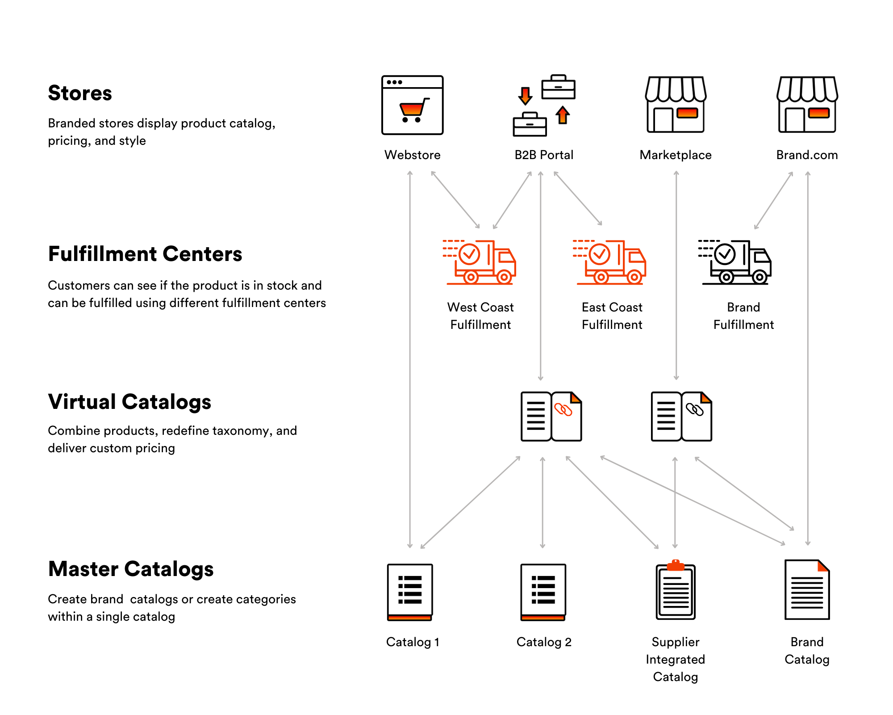
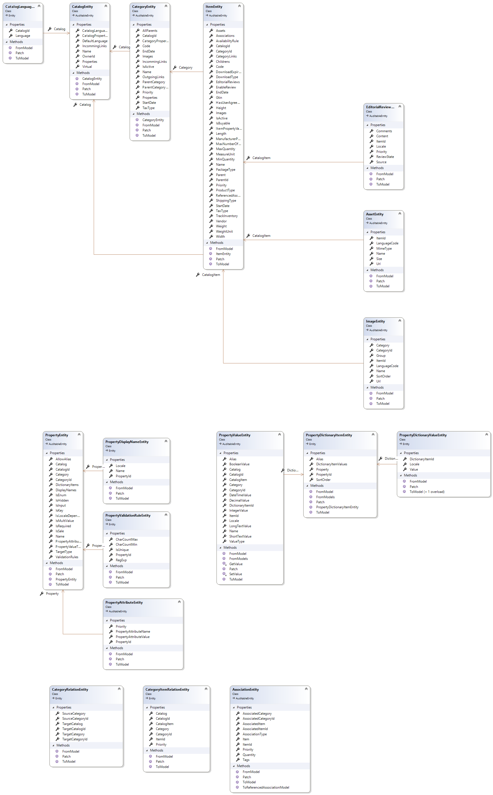

# Overview

    

The Catalog module presents the ability to add items to your e-commerce store.  It can be electronics, groceries, digital content or anything else. Items can be grouped into categories and catalogs. The item grouping is individual depending on the stock size, item types, vendors, etc.

The Catalog Module supports two types of catalogs - physical and virtual.

### Common Catalogs

A (common) catalog is defined as a list of items or services that a company showcases online. Physically the catalog is a collection of items, which can be grouped into categories. An item can be assigned to only one category or be direct child of a catalog without any category.  

 Each trademark or product line may have its own catalog of all the offerings in that category. Or when dealing with several suppliers, in this case each supplier may have its own catalog with offered items.

#### Scenarios

[View Catalogs And Physical Items Details](view-catalogs-and-physical-items.md)

[Add New Catalog](add-new-catalog.md)

### Virtual Catalogs

Virtual catalogs are created from one or more common catalogs. This kind of catalogs aggregates multiple base catalogs into a single catalog.
For example, a Virtual catalog may be used to display seasonal goods that can be collected from multiple catalogs.

A virtual catalog must have a unique name different from other virtual catalogs and common catalogs. Though virtual catalogs are composed of items and categories from common catalogs, items from a virtual catalog cannot be added to another virtual catalog.

The major difference between a catalog and a virtual catalog is that the second one is just a view of items from common catalogs.
 Physically all items from a virtual catalog are located in common catalogs. This also means that if a modification is made to an item in the common catalog, the update will be reflected in all virtual catalogs instantly.

#### Scenarios 

[Add Virtual Catalog](add-virtual-catalog.md)

### Categories

A category is a container for other categories or items. Category in the catalog can have sub-categories.

Categories allow building hierarchies and relationships between various items in the catalog. This helps customers to navigate on client side to the items they would like to purchase.

Large catalogs containing many items might be reasonable to organize using parent-child relations.

#### Scenarios

[Manage Categories](manage-categories.md)

### Items (Product)

A product with its variations in the system is presented as a collection of products (variations).

There are two types of products presented in the Catalog- physical products and digital products.

The title (main) product has variative property set of values. All product variations have the parent-child relation with the title product. Thus, variation inherits property values of the title product (e.g. description, assets etc.) but can also override the values of those properties if they differ from the title product property values.

To show such a product with variations on the storefront, the title product (main) is loaded with all the related products (variations). Property values of the title product are used for product description. SKU selector for such a product with variations is built using variations properties of the title product and its variations.
So, an item concept in Virto Commerce is a generalization of Variation/SKU or Product. An item corresponds to item in the store that can be promoted and sold.

User can manage simple item properties as well as complex information:

1. Custom properties.
1. SEO information.
1. Associations (associated items).
1. Assets.
1. Images.
1. Videos.
1. Variations (SKUs).
1. Inventory
1. Prices.

Inventory and prices management are integrated from other modules - “Virto Commerce Inventory” and “Virto Commerce Pricing” respectively.

#### Scenarios

[Manage Products](manage-physical-products.md)

[Product Indexing](product-indexing.md)

### Variations

In case there is a need to add variations of the product, a relation should be implemented between the products as well as special type of variative properties definition added.

Thus, a product with its variations in the system is presented as a collection of products (variations). The title (main) product is a parent variation and has all variation properties. And all other variations are related as children to the title product.

 Every product that has relation to the title product (variation) can inherit some property values of the title product (description, assets etc.) but can also override the values of those properties if they differ from the title product (variation) property values.

To show such a product with variations on the storefront, the title product is loaded with all the related products (variations). Property values of the title product (variation) are used for the main product description.

SKU selector for such a product with variations is built using variations properties of the title product and its variations.

#### Scenarios

[View Product Variations](view-product-variations.md)

[Manage Product Variations](manage-product-variations.md)

### Properties

Properties (or custom properties) are the additional characteristics for your catalog entities. They can be defined at different levels of item hierarchy:

1. Catalog - value assigned in catalog level.
1. Category - value assigned in category level and can be overwritten in child categories.
1. Product - value assigned in item or variation level.

All properties defined in parent hierarchy entities are available in (inherited by) item. E.g. every item inside catalog will have property “Brand” with value “Sony” once it was defined in parent catalog and was assigned such value there.

Every property has its “Assign to” trait set to one of: “catalog”, “category”, “product” or “variation”. This defines at what level the property’s value can be set.

#### Scenarios

[View Properties](view-properties.md)

[Manage Properties](manage-properties.md)

### Linked Category

Common category has the same meaning as the category in common catalogs. User can create common category and link products to it or create linked category in it.

**Possible Operations**
catalog CRUD:

- properties

category CRUD:

- properties;
- SEO.

virtual catalog CRUD:

- categories;
- including categories from other (real) catalogs.

Expandability points:

- additional widgets in (virtual) catalog detail;
- additional widgets in category detail;
- additional widgets in item detail.

## VirtoCommerce Search

The solution uses Search as primary tool for customer interaction. The customers expect high-level relevance, multiple-languages and near-instantaneous responses.

### Benefits

1. Document based full text search and text analysis for Products, Categories and Members;

1. Search by keyword, filters, aggregations and geo-search;

1. Supports multiple search engines: Elastic Search, Elastic Cloud, Azure Search and Lucence;

1. Functionality, which implements the inherent complexity of information retrieval is exposed through REST API or .NET SDK;

1. The supported document types (Product, Category, Member) can be easily extended by third party team.

### Architecture Overview

The Architecture is focused to isolate the search engine from documents and provide abilities to add new types of documents.

[Search Engine Architecture Details](search-engine-architecture-details.md)

[Catalog Search](catalog-search.md)

### Elastic Search

https://github.com/VirtoCommerce/vc-module-elastic-search

### Azure Search

https://github.com/VirtoCommerce/vc-module-azure-search

### Lucene Search

https://github.com/VirtoCommerce/vc-module-lucene-search

Lucene Search Module is recommended for development purposes only, not for production usage

### Search Provider Tests

https://github.com/VirtoCommerce/vc-module-search/blob/master/tests/VirtoCommerce.SearchModule.Tests/SearchProviderTests.cs

## Search Index

VirtoCommerce platform provides a unified solution for indexing and searching of different types of objects. The search engine should not operate directly with the database, especially when full text search, aggregations, partial search are needed. For this reason, from the architecture point of view, it was decided to isolate the search engine from the documents that should be searched.

The Search Index is used to improve the search performance and speed.

The indexing process starts automatically based on a pre-defined schedule. But at the same time, VirtoCommerce Platform provides the possibility to start the indexing process manually if needed.

[Manage Search Index](manage-search-index.md)

[Glossary](glossary.md)

## Data Model Diagram

