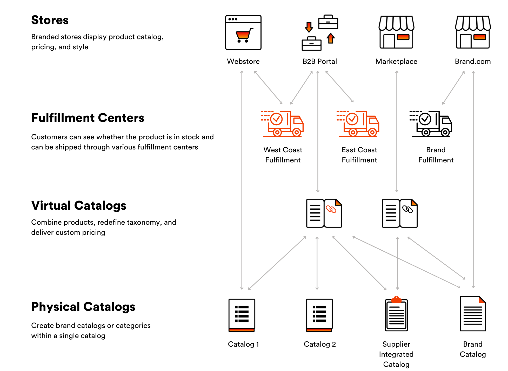
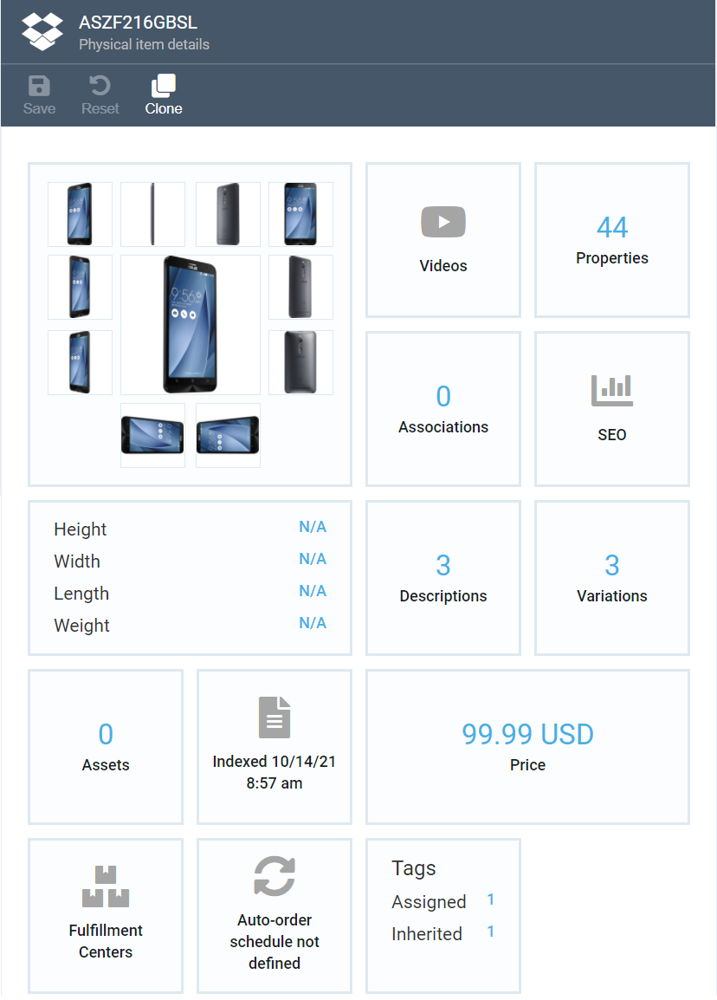

# Overview

    

Catalog is a Virto’s module that enables adding items to your ecommerce store to market any physical goods or digital content. The items being marketed can be grouped into catalogs and categories based on various properties, such as stock balance, item types, vendor, brand, etc.

The chart below shows how various high-level entities are linked to one another in the Virto Platform.

Chart 1: Logical dependencies in Virto Commerce Catalog

As shown above, you can have one or more stores which both physical and virtual catalogs are linked to. For more info on those types of catalogs, please see below and also check out our [Terminology](glossary.md) section.

***Note:*** *Fulfillment centers are relevant to physical products only. If a store markets digital content, such as software or music, it will not require any such centers.*

Another chart below depicts the main entities in the Catalog module with their core properties and attributes and shows the connections between them.

Chart 2: Core entities and their linking in Virto Catalog

***Notes to the Chart:***

1.	You can have any number of stores. However, each store must have at least one catalog.
2.	A catalog may have multiple categories and/or products or may not have any at all.
3.	*Catalog* and *Product* are logical categories that may only appear as physical or virtual for the former, and physical or digital for the latter.
4.	While sharing some attributes in common, physical and digital products do have unique ones, such as *Track Inventory* for physical product or *User Agreement* for digital one.

## Physical Catalogs

In a nutshell, a physical catalog is a list of products or services that a company showcases online. All products can be grouped into categories, while one product may be assigned to a single category only or be a direct child of a catalog without any category.

Figure 1: A list of physical catalogs

***See also:***

[Viewing Catalogs and Physical Item Details](view-catalogs-and-physical-items.md)

[How to Add a New Catalog](add-new-catalog.md)

## Virtual Catalogs

You can create virtual catalogs based on one or more physical ones. For example, a virtual catalog may be used to display seasonal goods that, in technical terms, would be various products picked from multiple physical catalogs.

Any virtual catalog must have a unique name that is different from those of other virtual or physical catalogs. Though virtual catalogs are composed of products and categories from the physical catalogs, you cannot add products from a virtual catalog to another virtual catalog.

Basically, a virtual catalog is none other than just a way to display (visualize) products. Technically, all items are located in physical catalogs, hence the name. This also means that if you modify any item in a physical catalog, the respective virtual catalogs will instantly get updated as well.

Figure 2: Creating virtual catalogs based on physical ones

***See also:***

[How to Add a Virtual Catalog](add-virtual-catalog.md)

## Categories

A category is basically a container for other categories, subcategories, or products.

Categories enable building hierarchies and links between various items in the catalog, which helps the customers navigate to the items they would like to purchase.

If you have large catalogs containing many items, you might want to create multiple categories and subcategories using the parent-child structure.

Figure 3: Example of a list of categories in a consumer electronics online store

***See also:***

[How to Manage Categories](manage-categories.md)

## Products

A product is a basic entity representing an item one can purchase in an online store. The Catalog module offers the following types of products (see also Chart 2 ): 

- Physical products: any tangibles, such as cameras or mobile phones
- Digital products: Intangibles such as software or music

***Note:*** *Both physical and digital products have their own unique attributes (see also Notes to Chart 2):*
- Bill of materials: A special kind of product that has a list of supplementary materials required for a specific item
- Configurable products: A fully customizable item that has unique attributes and thus cannot fall into the above types

Any product may also have one or more variations; for consumer electronics, those could be size or color variations, among others. Technically, a variation is a separate product entity that, at the same time, is linked to its master product. For instance, if a mobile phone is a master product, its variations may include black, white, or red versions, or 5’’ and 6’’ versions (or both).

All variations inherit property values of the master product, such as description and assets, but may also override those values, when required.

You can configure the following attributes for your products:

1.	Custom properties
2.	SEO text
3.	Associations (e.g., related items)
4.	Assets 
5.	Images
6.	Variations  
7.	Inventory  
8.	Prices

***Note:*** *Some attributes may not be applicable to a particular type of product. E.g., bill of materials may not have any variations, while digital product has no inventory, as it is intangible.*

***Note:*** *For inventory and price management, Virto Commerce offers the [Inventory](https://virtocommerce.com/docs/latest/modules/inventory/) and [Pricing](https://virtocommerce.com/docs/latest/modules/pricing/) dedicated modules.*

Figure 4: Product page displaying various attributes of a single product, including variations and properties

***See also:***

[Managing Products](manage-physical-products.md)

[Product Indexing](product-indexing.md)

[Managing Product Variations](manage-product-variations.md)

## Properties

Custom properties are additional parameters for catalog entities at various levels:

1.	Catalog level: A property belonging to entire catalog
2.	Category level: A property assigned to a category that may be overwritten in child categories
3.	Product level: A property assigned to a single product or its variation

***Note:*** *All properties defined at a higher level are automatically inherited at all lower ones. For instance, if you assign the* ***Brand*** *property with the* ***XXX*** *value to a catalog, all categories and products within that catalog will also have* ***XXX*** as ***Brand***_._

Figure 5: Property view that displays custom properties of an item being marketed

***See also:***

[Managing Properties](manage-properties.md)

## Search

Virto Commerce offers the Search tool that provides high level relevance, multiple languages, and near-instantaneous responses.

### Key Advantages:
- Document based full text search and text analysis for Products, Categories, and Members   
- Search by keyword, filters, aggregations, and geo-search  
- Supports multiple search engines: Elastic Search, Elastic Cloud, Azure Search, and Lucene
- Inherent complexity of information retrieval processed through REST API or .NET SDK
- The supported document types can be easily extended by a third-party team

### Search Index

The Virto Commerce platform provides a unified solution for indexing and searching for various types of objects. The Search Index is used to improve the search performance and speed.

The indexing process starts automatically based on a pre-defined schedule. However, you can start the indexing process manually at any time, if required.

***See also:***

[Managing Search Index](manage-search-index.md)
