# Managing Categories

## Adding New Category

You can add a new category to the Catalog following these simple steps:

1. Open the Catalog module and select the appropriate catalog, which will take you to the *Categories and Items* screen.
1. Click the *Add* button.
1. The *New category item* screen will show up, prompting you to choose one of these three options:  

      + Category
      + Physical product
      + Digital product

     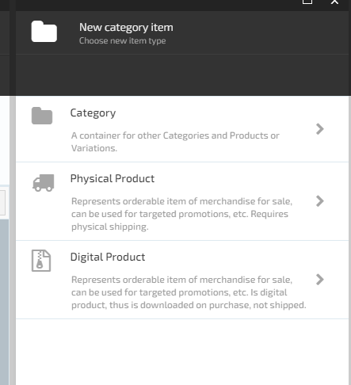

     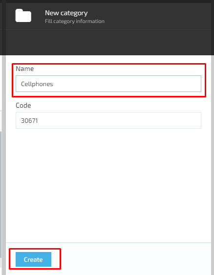
1. Select *Category*. This will open the *New Category* screen with the following elements:

      + *Name* text box
      + *Code* text box (the code is automatically generated by the system)
      + *Create* button, which will be grayed out until you provide the category's name
1. Give your category a name and click *Create*.
1. Once your category is created, the *Category Details* screen will show up. This screen houses the following properties: 

      + *Active* toggle button that allows you to activate or deactivate your category
      + *Priority* text box
      + *Name* text box
      + *Code* text box
      + *Tax type* dropdown list, where you can either select a tax type value or add a new one
      + *Images* widget
      + *Properties* widget
      + *SEO* widget  
      + *Search index* widget
      + *Tags* widget

***Note:*** *You can edit Name, Tax type, and widgets, while the Code field is uneditable.*

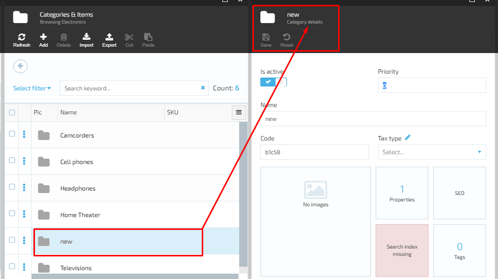

1. Fill out the details, configure the widgets as you prefer, and click *Save*. Your new category will show up in the *Categories* list.

### Adding Tax Type

To add a tax type value, do the following:
1. Click the *Edit* button on the *Category Details* screen, which will open the *Tax Types* screen.
1. Give your tax type a name and click *Add*.
1. On the next screen, select your newly added type from the list and click *Save*.
1. This is it! Your new tax type will be displayed in the *Tax type* dropdown list.

***Note:*** *You can add as many tax types as you deem necessary.*  

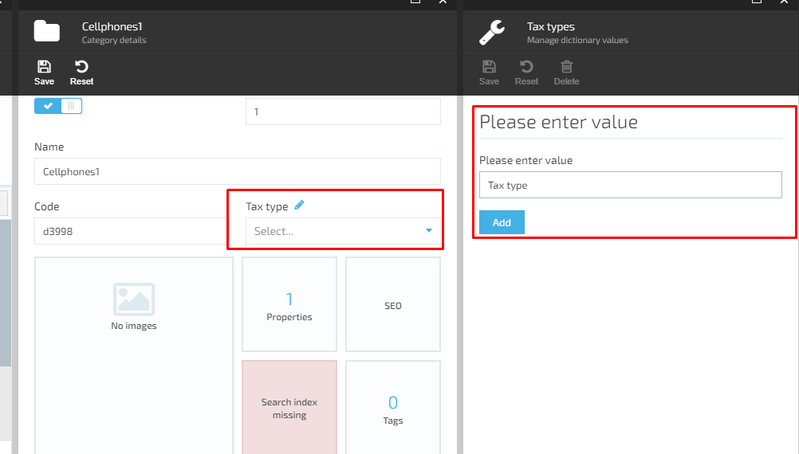

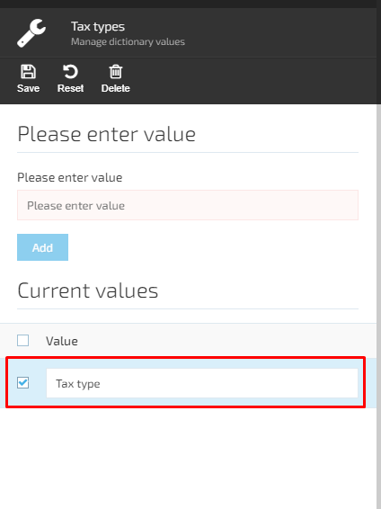

### Images Widget

To add images to a category, do the following:
1. Select the *Images* widget on the *Category Details* screen, which will open the *Manage Images* screen.
1. Click *Add*. This will take you to the *Upload Images* screen with the following items:
     + *Image category* dropdown list, where you can also add new categories
     + *Language* dropdown list
     + *Select images* space with the *Drag and drop* and *Browse file* options
1. Specify the required details and click *OK*. Your image(s) and other appropriate info have now been saved to the system. 

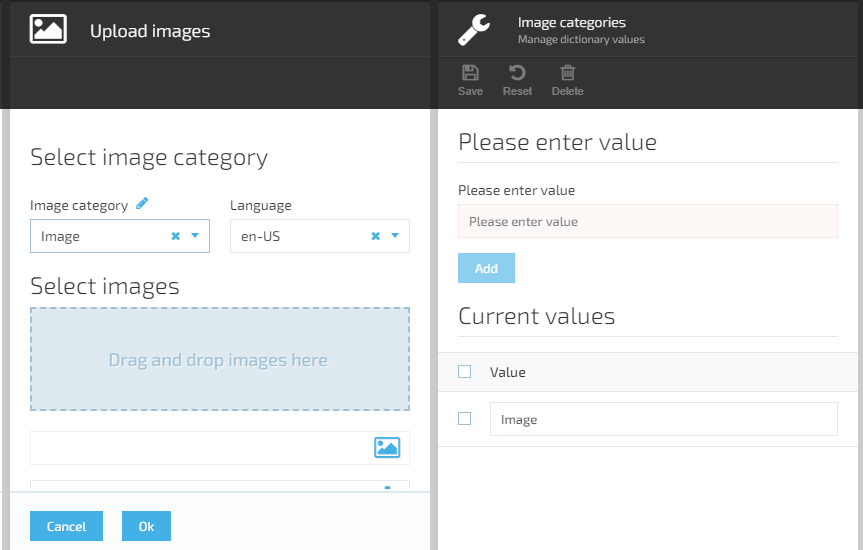

### Properties Widget

To add properties to a category, follow these steps:
1. Select the *Properties* widget on the *Category Details* screen to open the *Property List* screen where you can add a new property.
1. Click *Add property*. This will open the *Manage property* screen with the following items:
     + *Property name* text box
     + *Display name* text box
     + Toggle buttons:
         + Dictionary
         + Multivalue
         + Multilanguage
         + Hidden  
     + *Applies to* dropdown list with these options:
         + Category
         + Product
         + Variation
     + *Value type* dropdown list with these options:
         + Short text
         + Long text
         + Decimal number
         + Date time
         + Boolean
         + Integer
         + Geo Point  
1. Specify the information based on your needs and save your changes. The new property will be added to the Category.
  
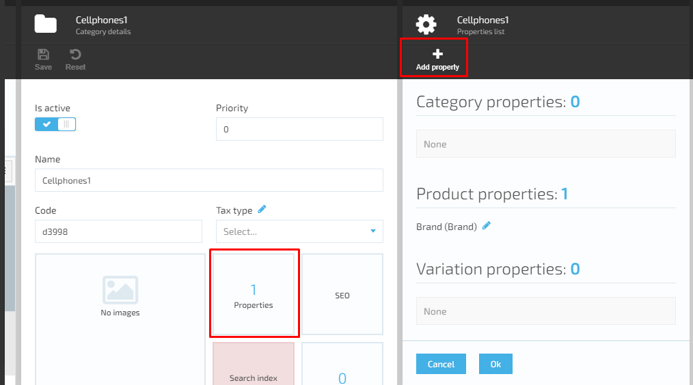
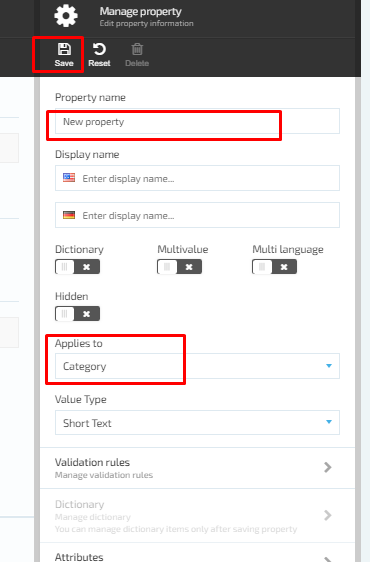

#### Managing Validation Rules

You can manage the validation rules for all the category properties following these steps:

1. Select *Validation rules* on the *Edit property information* screen. This will take you to the *Manage validation rules* screen with the following items:

     + Toggle buttons:
         + Required
         + Limit character count
         + Match a specific pattern
     + *Limit character count* dropdown list (when active):  
         + *Between*: Specify the minimum and maximum allowed number of characters through the *Min* and *Max* fields 
         + *At least*: Specify the minimum char count within the *Min* field
         + *No more than*: Specify the maximum char count within the *Max* field  
     + *Match a specific pattern* dropdown list (when active):
         + Custom
         + Email
         + URL
         + Date

     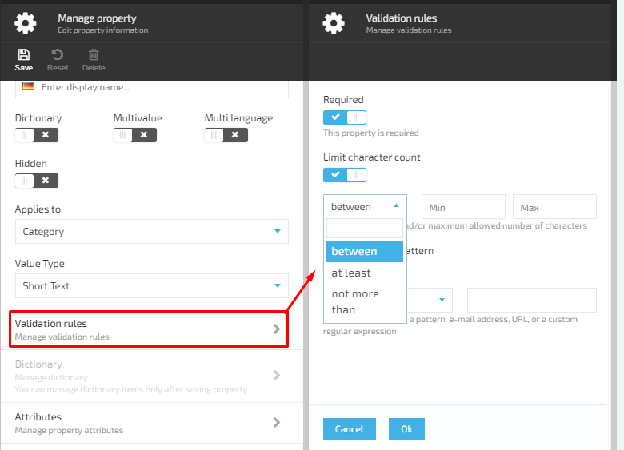

     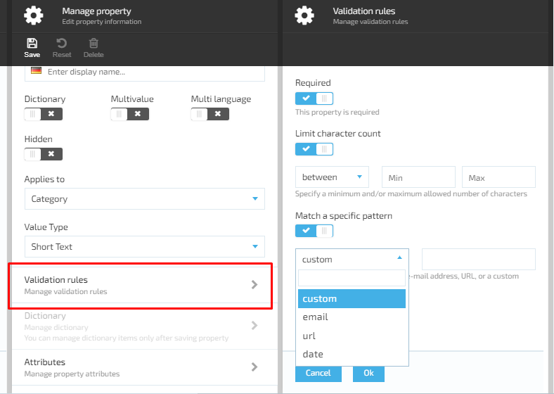

#### Managing Property Attributes

To manage property attributes, do the following:
1. On the *Manage property* screen, select *Attributes* to open the *New property attributes* screen.
1. Enter the new property name, specify the appropriate values, and click *Add*. This will add the new attribute to the property attribute list.  

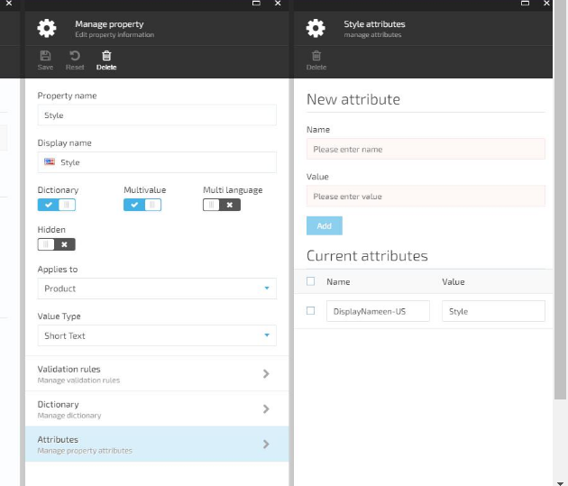

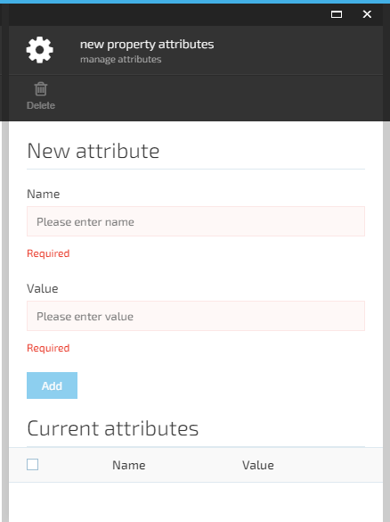

### Managing SEO 

To add a new SEO block, complete the following steps:

1. Select the *SEO* widget on the *Category details* screen to open the *Manage SEO* screen with the following items:  
     + *Active* toggle button that allows you to activate or deactivate your SEO block
     + *Store* dropdown list where you can pick the store this new SEO block will apply to
     + *Language* dropdown list where you can pick the language for your new SEO block
     + *URL keyword* textbox (required)
     + *Page title* textbox  
     + *Meta description* textbox
     + *Image alternative text* box
     + Buttons:
         + *OK*: Becomes active when you fill out all required fields
         + *Cancel*: An always active button that allows you to go back without saving changes
1. Fill out all required information and click *OK*. This will add your new SEO block to the SEO list.  

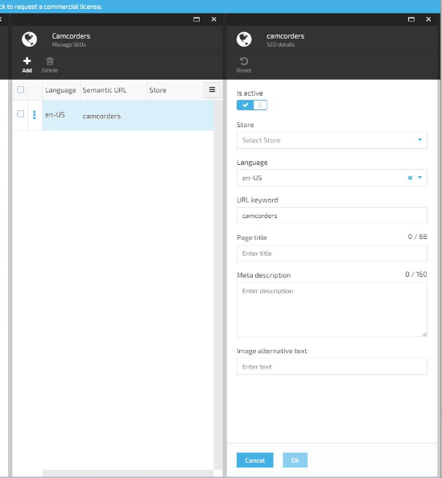

#### Assigning Tags

To assign tags to a certain category, do the following:  

1. On the *Category Details* screen, select the *Tags* widget. In the next screen, assign tags based on the following items:

     + *Available tags* dropdown list, which also allows you to add a new tag
     + List of assigned tags

1. Select the tag from the dropdown list and click *Add*. The tag will appear in the *Assigned tags* list.

#### Adding New Tag

To add a new tag, do the following:
1. Click the *Edit* icon next to the *Available tags* label.
1. On the screen that will show up, enter the required value and click *Add*. Your new tag will be added to the tag list and displayed in the *Available tags* dropdown list.  

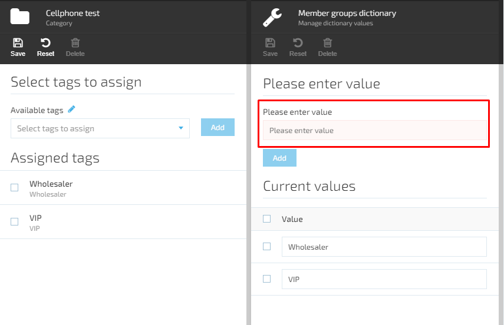

### Links Widget

The *Links* widget allows you to link categories to virtual catalogs. This is how you can do it:

1. Select the *Links* widget on the *Category details* screen. This will open the *Links list* blade, where you can create a new link to a virtual catalog or a category inside a virtual catalog.
1. Click *Add* to open the *Select catalog items* screen, where you can: 
    + Select a catalog from a list of virtual catalogs
    + Open a list of subdirectories after clicking a catalog record
    + Select a category from the list

***Note:*** *You cannot select the current category (if it is in the list), categories labelled as Marked, or category links inside virtual catalogs.*

1. Pick the appropriate catalogs or categories from the list and click *Confirm*, which will create links to the current category within the selected virtual catalogs and categories. 
1. Pick the links from the list and click *Delete* if you want to remove the selected links.

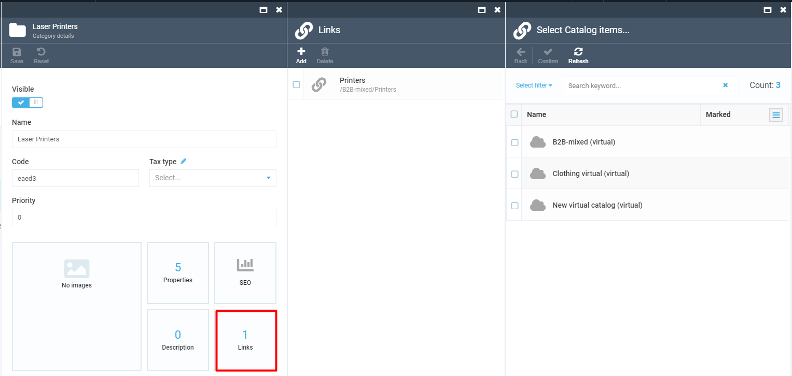
