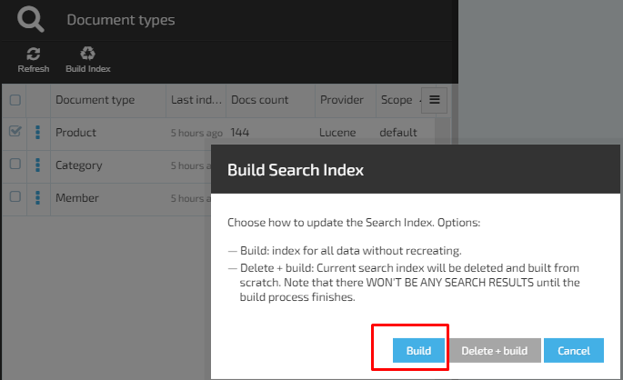
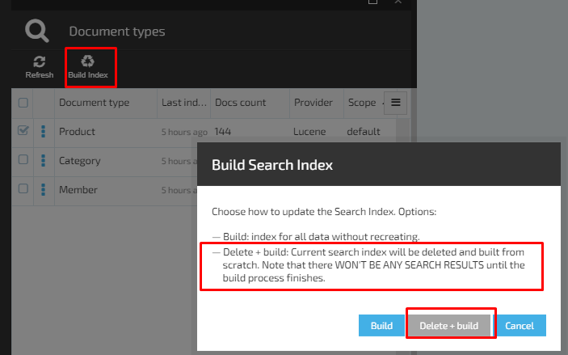

# Manage Search Index

Each document is stored in the index, and has the type and ID. The document is a JSON object that contains zero or more fields or key-value pairs. The original JSON document indexing will be stored in the field_source that returns a default receipt or document search.

The analysis is performed by а custom analyzer defined by index. Token filter:
- custom_edge_ngram (default) 
- custome_ngram

Mapping is used to define how a document and its fields are stored and indexed.

## Scenarios

### View Document Types in Search Index

1. In order to view the Documents type, the user should open the 'Search index' tab;
1. The system will open the 'Document types' blade and display a table containing the following columns:
     1. Document type;
     1. Last indexed;
     1. Docs count;
     1. Provider;
     1. Scope.
1. The following types of documents will be displayed in the table:
     1. Product;
     1. Category;
     1. Member.
1. The 'Build index' button is disabled if no document type is selected.

### Build Index

1. The user selects a Document type (example Product) and clicks the 'Build Index' button
1. The system will display a pop up window with the following message: **'Choose how to update the Search Index. Options:
Build: index for all data without recreating.
Delete + build: Current search index will be deleted and built from scratch. Note that there WON'T BE ANY SEARCH RESULTS until the build process finishes.'**
1. 'Build', 'Delete + Build', 'Cancel' buttons are active
1. The user clicks the 'Build' button
1. The build will run through all the objects and index them into the search engine.

### Delete And Build Index

1. The user selects a Document type (example Product) and clicks the 'Build Index' button
1. The system will display a pop up window with the following message: **'Choose how to update the Search Index. Options:
Build: index for all data without recreating.
Delete + build: Current search index will be deleted and built from scratch. Note that there WON'T BE ANY SEARCH RESULTS until the build process finishes.'**
1. 'Build', 'Delete + Build', 'Cancel' buttons are active
1. The user clicks the 'Delete+Build' button
1. The current search index of the selected document will be deleted and indexing process will start. 'Delete+Build' is a system operation.

