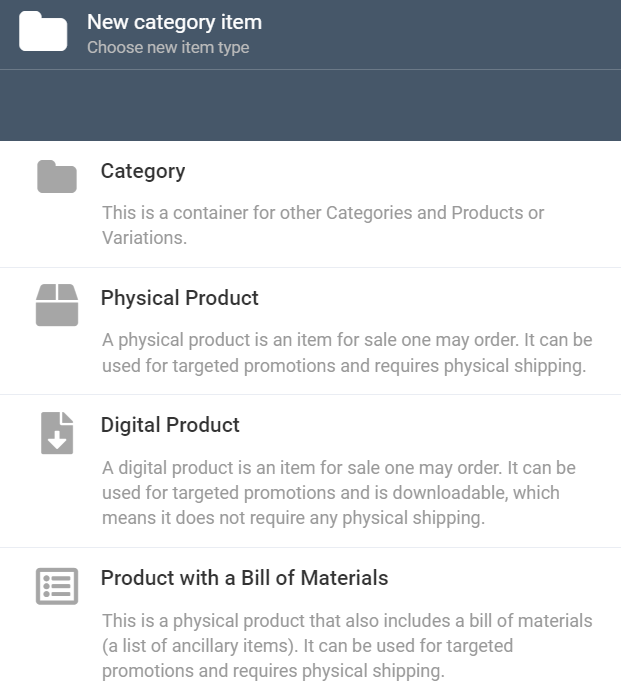
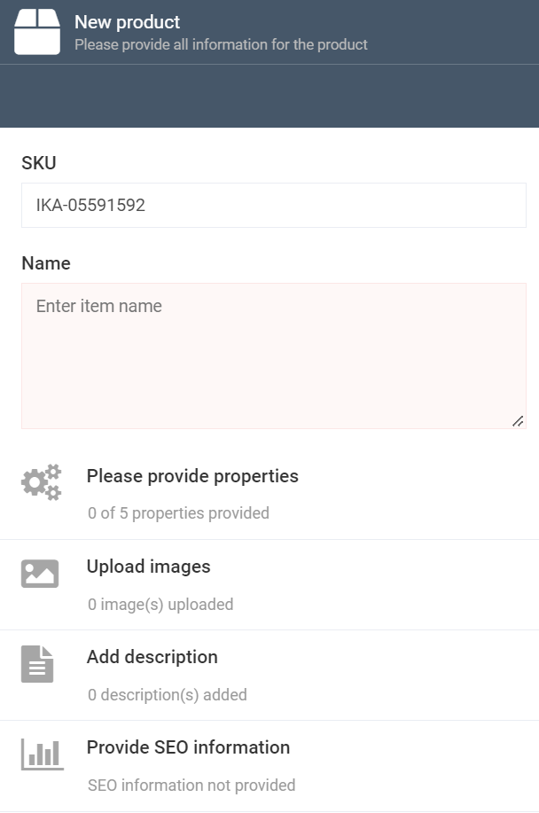
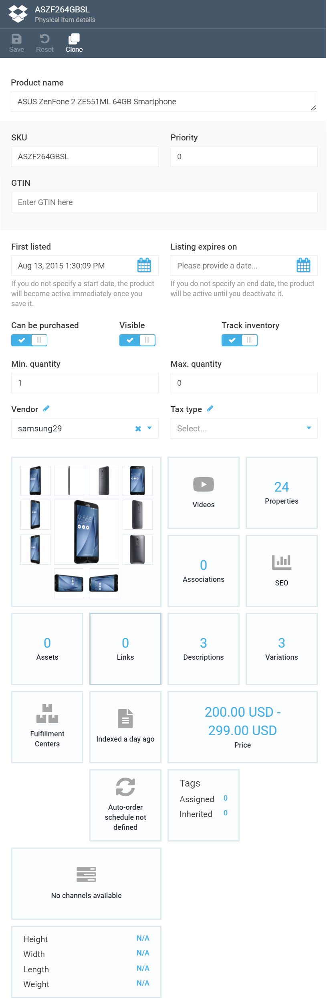
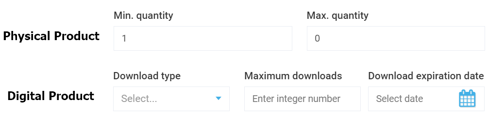
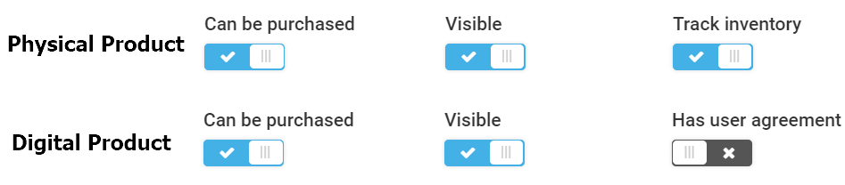
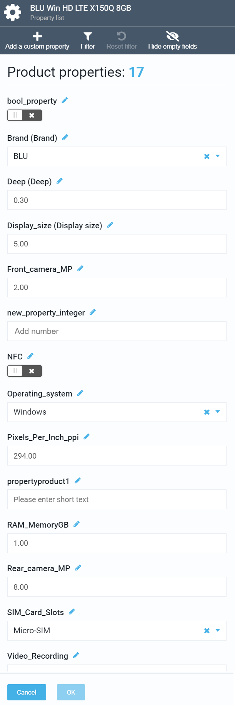
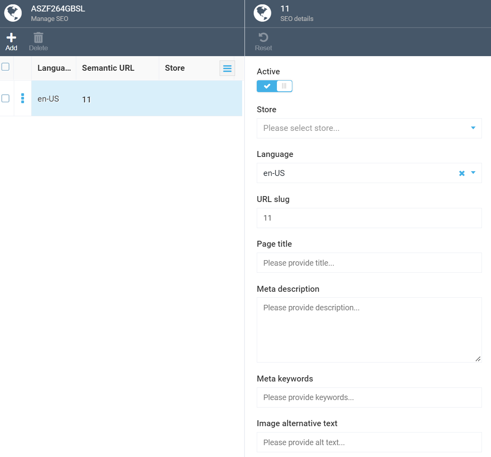
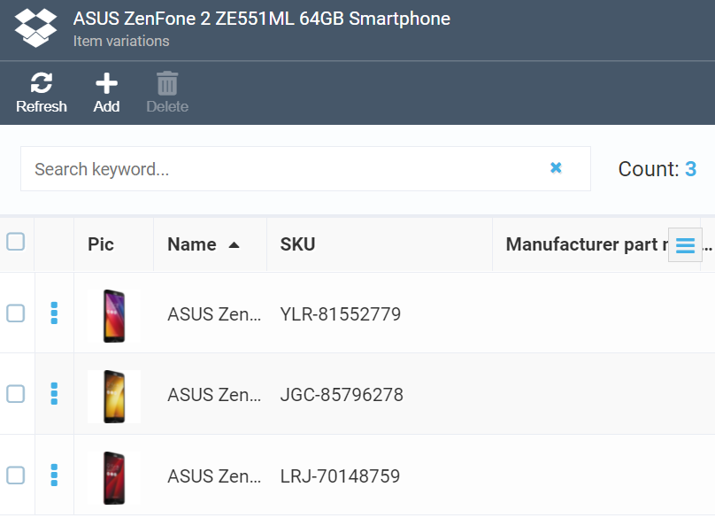
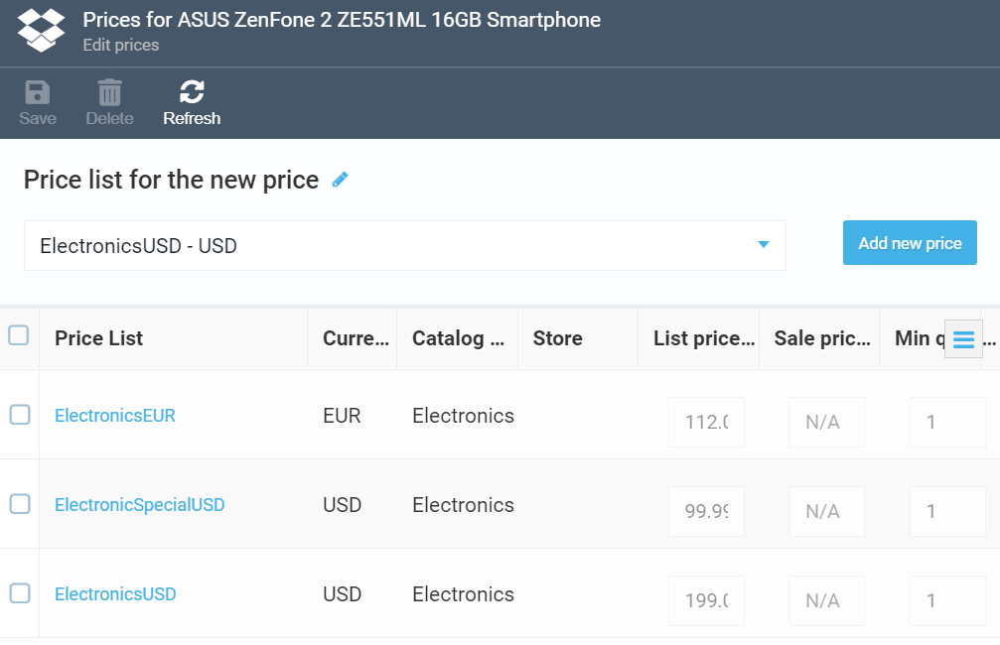
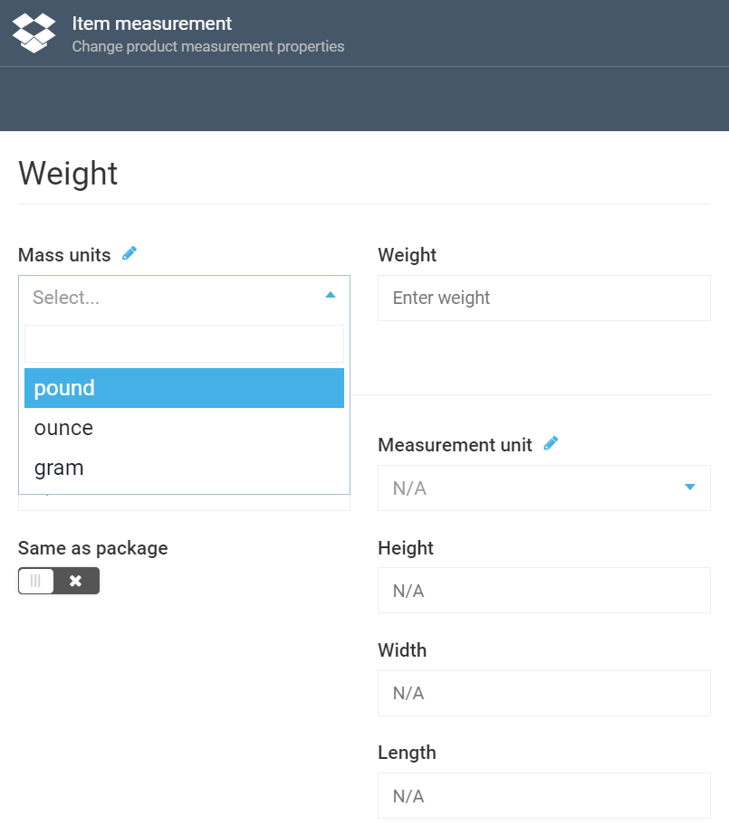

# Managing Products
Virto's Catalog module allows you to work with various types of product within your catalog, which includes Physical Products, Digital Products, and Products with a Bill of Materials. To learn the difference between these product types, please refer to the [Terminology](glossary.md) section.

## Adding Product
The below steps apply to creating a new product of any type. There are slight differences, however, depending on which particular type of product you create; we will also explain this below. 

To add a new product to your catalog, select it to open the *Categories and Items* screen and hit *Add*:

 
 
This will take you to the *New Category Item* screen, from which you can choose the type of product you want to create:
 
 
 
 ***Note:*** *As you can see, this is the same screen you can create categories from. For more information, you can refer to [this section](managing-categories.md). Here, we will focus on creating new products.*

Once you pick the relevant option for creating your product, you will be taken to the *New Product* screen:

Here, you can provide some basic information on your new product:
 
 1. The *SKU* text box houses the stock keeping unit code used to track the product inventory. It is generated automatically by the system and cannot be edited.
 2.  The *Name* text box allows you to give your new product a name.
 3. Click *Provide properties* to add as many properties to your product as you need. You will also be able to add more custom properties after your product has been created through the *Item Details* screen (see also the section below).
 4. Click *Upload images* to upload one or more images of your product that will appear on the store.
 5. Click *Add description* to provide your product with one or more descriptions.
 6. Finally, you can also *Provide SEO information*, such as title, description, keywords, etc.  
Once you hit the *Create* button, your new product will be added to the selected category or catalog.

## Viewing and Managing Product Details
To view and manage your product details, locate the item in question in the respective catalog and/or category and click it. This will take you to the *Item Details* screen, which will say *Physical Item Details*, *Digital Item Details*, or *Bill of Materials Item Details*, depending on which type the product belongs to. Below, there is an example of how the *Physical Item Details* screen will look like for a smartphone product:

As you can see, this screen may be logically divided into two parts, the first having fields and some toggles, and the second, widgets; most of them are configurable. Let's take a closer look on both parts and explain some of the details.

### Fields and Toggles

#### Fields
All fields, except *SKU*, are configurable. For instance, you can configure the following:
 
+ *First listed:* Allows you to specify the start date when the product becomes active on the store. If you leave it blank, the product becomes active once you save it.
+ *Listing expires on:* Allows you to specify the date when the product expires. Leave this field blank to keep your product active until you manually deactivate it.
+ *Name*: Here you can specify the name of your product being displayed to the store customers.
+ *GTIN:* Global trade item number, a part of a numeric code used to uniquely identify a product.
+ *Min quantity* and *Max quantity:* Allows you to set how many items of this product one may order from the store.

***Note:*** For digital products, these fields are irrelevant; instead, they will have the *Download type*, *Maximum downloads*, and *Download expiration date* fields, which can of course also be configured:

+ *Vendor:* A drop down list allowing you to select a vendor or add new vendors that supply the product in question.
+ *Tax type:* A drop down list used to select an existing tax type or add some new ones.

#### Toggles
The toggles also vary depending on whether it is a physical or a digital item:

+ *Can be purchased:* Enables or disables customers to purchase this product from the store.
+ *Visible:* Displays or hides the product from the store customers.
+ *Track inventory:* Enables or disables inventory tracking (for physical products and products with a bill of materials only).
+ *Has user agreement:* Shows whether a user agreement is necessary to buy this product (for digital products only).

### Widgets
All widgets within the *Item Details* screen are used to configure various product details. Out of those, the most important are:

+ *Properties:* Allows you to add, edit, or delete as many product properties as needed (see also Step 3 in the **Adding Product** section):

+ *Associations:* Allows you to add associated products to the selected one that will be visible on the store together with the main product (e.g. *Related Products* or *These items may also interest you*). You can create as many groups of associations as needed and add tags, number and items to the selected group.
+ *SEO:* A centralized pane to manage all SEO information for the product in question. You can store SEO data in various languages:

+ *Variations:* Always includes the main product variation. The user can add new product variations or edit or delete the existing ones:

+ *Assets:* Contains references to all assets (e.g. images) associated with this product. You can both add new assets and remove the existing ones.
+ *Videos:* Allows you to add YouTube videos by specifying the relevant URLs.
+ *Price:* Contains the price lists that refer to this product. You can both add new price lists and edit or delete the existing ones:

+ *Item measurement:* Enables specifying weight and dimensions of a product. This widget is not relevant to digital products and will only appear for physical ones or ones with bill of materials. Note that you can specify measurements using both US and metric measurement systems: 

