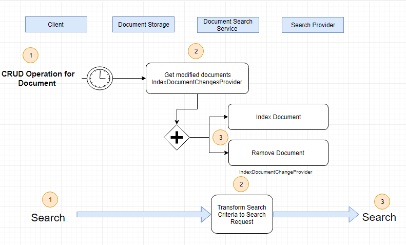

# Search Engine Architecture

## Asynch Processes

1. Indexations of new, updated and deleted documents;
1. Search documents.

## Abstarct Search Service Module

Provides ability to add custom types of documents:

1. ClassIndexDocumentConfiguration;
1. Interface Index Document Changes Provider- to detect modified documents;
1. Interface ISerach Request Builder- to transform Search Criteria to Search Request.

## Abstract Search Provider Model

Provide the ability to use different search engines:

1. Class Index Documents;
1. Interface ISearch Provider with basic operations:
     1. IndexAsync;
     1. RemoveAsync;
     1. SearchAsync;
1. Class Search Request.

